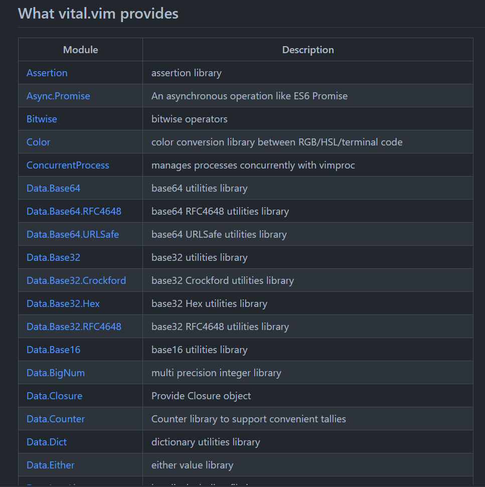

# Boost your vimrc with
# some template techniques!

- 2023-XX-XX
- [aiya000](https://twitter.com/public_ai000ya)

<a style="position: absolute; bottom: 0; left: 0; width: 150px; height: auto;" href="TODO: このスライドがあるURL">

</a>

- - - - -

# この発表はなに？

- - - - -

## この発表はなに？

TODO

- - - - -

# 僕

- - - - -

## 僕


- 名前
    - aiya000
- Twitter
    - [pubilc\_ai000ya](https://twitter.com/public_ai000ya)

- すき
    - 静的型付き言語
        - **Vim**・TypeScript・Haskell・Scala3・Idris
    - 数学
        - 圏論・代数的構造

- - - - -

## 僕

こういう数学の本を書いてます。

<div>
    <a href="https://aiya000.booth.pm/items/1298622"></a>
    <a href="https://aiya000.booth.pm/items/1298622"></a>
</div>

<aside class="notes">
せつラボっていう本を出しています。 <br />
数学がわからないけど、入門したい！ という人向けに、やさしい内容の本になっています。 <br />
このLTのこの画像をクリックすると販売ページに進めるので、よかったら買ってくれると、僕がよろこびます！ <br />
</aside>

- - - - -

[今日のLT資料](https://zenn.dev/aiya000/articles/cd06a0f3620d59)  
↑ クリック

<aside class="notes">
ちなみに、今回の資料はZennにも上げています。
もしよかったら、いいねをよろしくお願いします。
</aside>

- - - - -

## vimrcを加速させる！
## テンプレテクニック！

- - - - -

# vital.vim

- - - - -

## vital.vim

vim-jp製  
Vim scriptの**準標準**ライブラリ

https://github.com/vim-jp/vital.vim

```vim
let s:V = vital#vimrc#new()
let s:List = s:V.import('Data.List')
let s:Msg = s:V.import('Vim.Message')
let s:Promise = s:V.import('Async.Promise')
```

- - - - -

## vital.vim



- - - - -

## vital.vim


- - - - -

## vital.vim


...

いっぱいあるよ！

- - - - -

## vital.vim

Vim scriptを書くとき全般、  
つまりvimrcを書くときにも使える！

```vim
" 式指向でエラーメッセージを書く
let g:vimrc.open_on_gui =
  \ g:vimrc.is_macos   ? 'open' :
  \ g:vimrc.is_windows ? 'start' :
  \ g:vimrc.is_unix    ? 'xdg-open' : s:Msg.warn('no method for GUI-open')

" @a ~ @z の範囲にキーマップする
for x in s:List.char_range('a', 'z')
  execute 'nnoremap' '<silent>' $'@{x}'
    \ (":\<C-u>" .. $'call vimrc#execute_repeatable_macro("{x}")\<CR>')
endfor
```

- - - - -

# Vim scriptの
# 言語機能たち

- - - - -

## Vim scriptの言語機能たち

`$''` `$""`

String interpolation

```vim
" もう .. しなくていいんだ

" ↓ 読みやすい！
call system($'chown -R "{$USER}:{$GROUP}" "{foo_directory}"')

" ↓ 読みずらい ずら～
call system('chown -R ' .. $USER .. ':' .. $GROUP .. '"{foo_directory}"')
```

- - - - -

## Vim scriptの言語機能たち

```vim
if filereadable($'{$HOME}/dein_env.toml')
  call dein#load_toml('~/dein_env.toml', {'lazy': 0})
endif
" もうexpand('~')しなくてもいいんだ
```

- - - - -

TODO: autoloadに分けること
