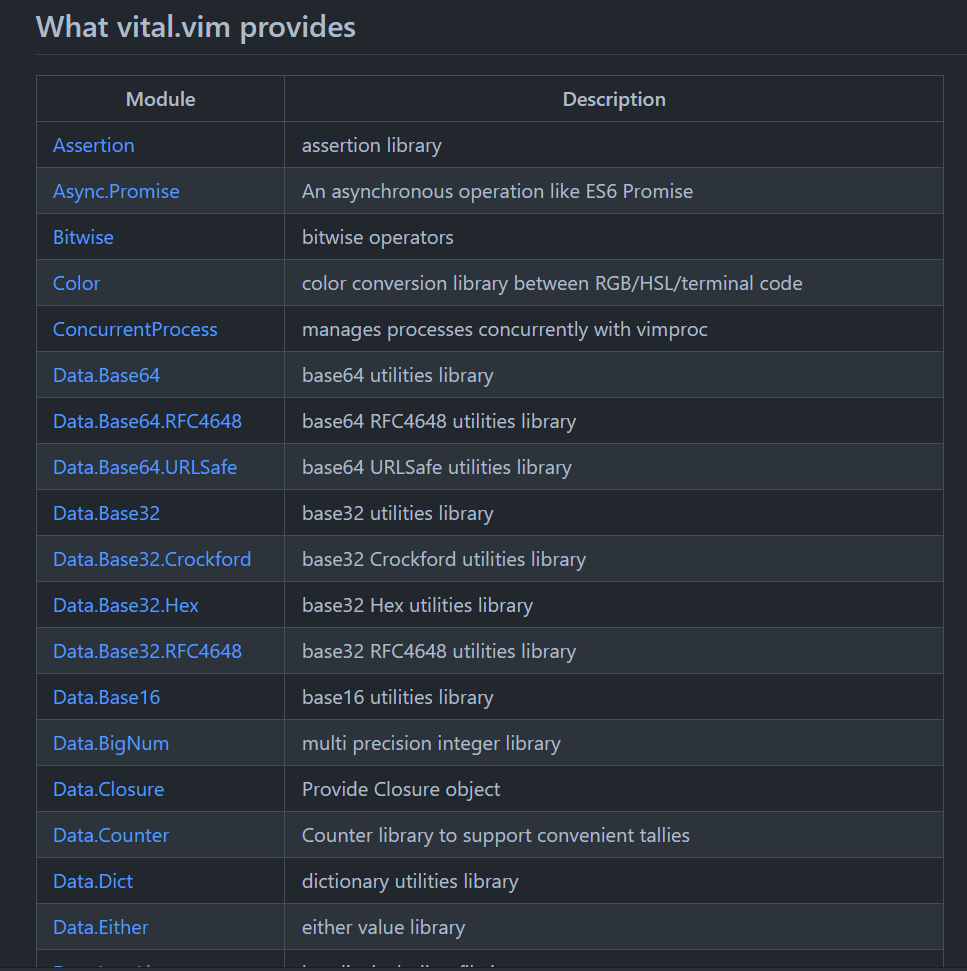
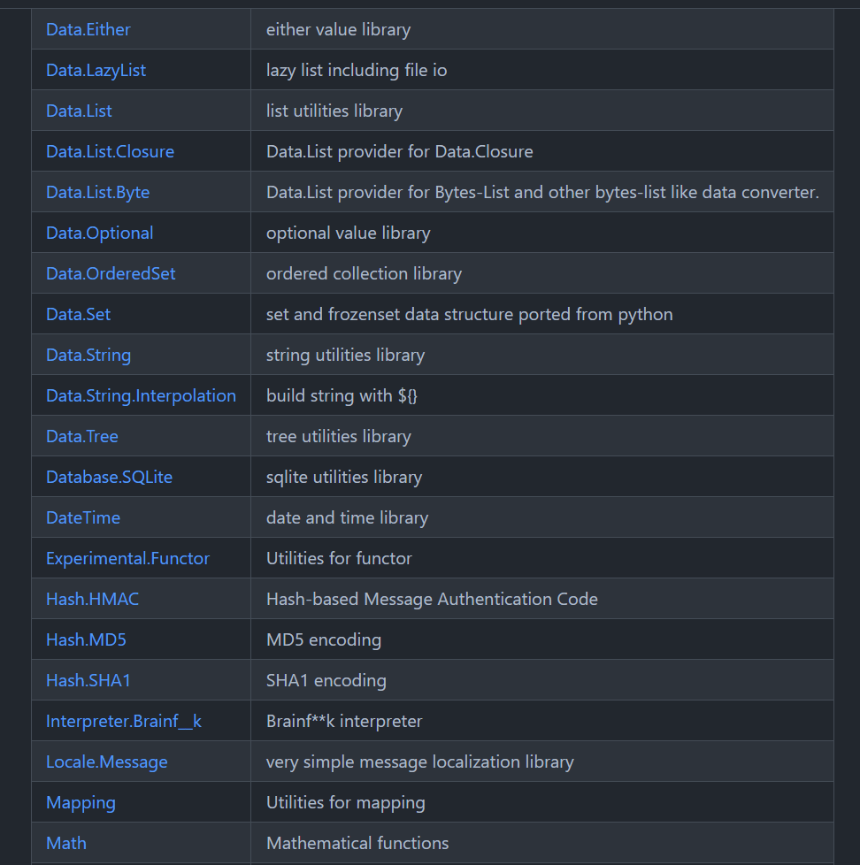
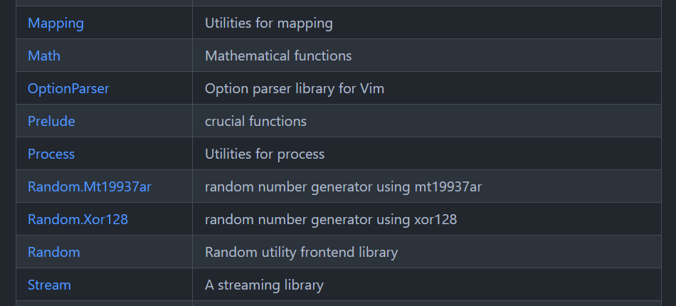
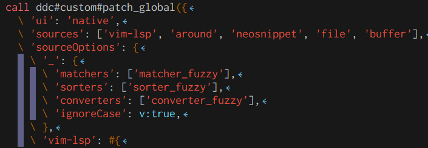
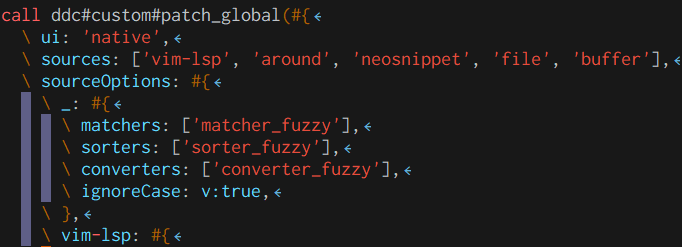

## Boost your vimrc with some template techniques!

- 2023-11-18
- aiya000（[@public\_ai000ya](https://twitter.com/public_ai000ya)）

<a style="position: absolute; bottom: -2; left: 0; width: 150px; height: auto;" href="https://aiya000.github.io/Maid/Boost-your-vimrc-with-some-template-techniques/#/">

</a>
<!-- 

-->

　

← This session's slide

<!-- 今回のキーワード

nice

# 👍

-->

<aside class="notes">
こんにちは、aiya000と申します。
これから「Boost your vimrc with some template techniques!」という発表をさせていただきます。
よろしくお願いします。 <br />
ちなみに今回の資料はzennにアップしています。
よかったらQRコードからアクセスしてみてください。
</aside>

- - - - -

# What is this session?

<aside class="notes">
さて、この発表が何かというと
</aside>

- - - - -

## What is this session?

- Learn how to **refine** your vimrc
- using some techniques

<aside class="notes">
.vimrcをよくしていく方法と、そのテクニックについて話していきます。
</aside>

- - - - -

# Me

<aside class="notes">
その前に、まず自己紹介をさせてください。
</aside>

- - - - -

## Me


- Name
    - aiya000
- Twitter
    - [@pubilc\_ai000ya](https://twitter.com/public_ai000ya)
- High tone Peter Pan 🤔

<aside class="notes">
僕の名前はaiya000と申します。
だいたいの人は「あいや」と呼んでくれています。 <br />
常に裏声で生活をしている、変なおじさんです。
よろしくお願いします。
</aside>

- - - - -

## Me


- Name
    - aiya000
- Like
    - Strong static typed languages
        - **TypeScript**, **Haskell**, Idris, Scala3
    - Math
        - Categoroy theory, Algebraic structure  
          ↑ a little bit :)

<aside class="notes">
好きなものは、強い静的型付き言語と、その型システムです。
必ずしも使用経験があるわけではないですが、**TypeScript**, **Haskell**, Idris, Scala3などが好きです。 <br />
TypeScriptは実務でガリガリにやっています。
Haskellについては過去にガリガリやっていました。
僕のふるさとはHaskellです。 <br />
<br />
数学も好きで、趣味でやっています。
圏論と代数を少しやっています。
</aside>

- - - - -

## Me

- I also love in **Vim** ;)

<aside class="notes">
そしてもちろん、Vimがだいすきです。 <br />
僕がパワーでハラスメントな会社で働いていたときは、
上司の目を盗んで、
Vimのヘルプを読んで心の安寧を得ていました。
</aside>

- - - - -

## Me

My works!

<div>
    <a href="https://aiya000.booth.pm/items/1298622"></a>
    <a href="https://aiya000.booth.pm/items/1298622"></a>
</div>

<aside class="notes">
あとは……
せつラボっていう本を出しています。
数学がわからないけど、入門したい！
圏論に入門したいけど、難しい！
という人向けに書きました。
数学の前提知識を仮定しない、全てこの本の中で説明する内容になっています。
なので初心者向けです。<br />
<br />
僕のzennのプロフィールにある、Twitterアカウントからこの商品をたどれるので、よかったら見てくれるとうれしいです！
サンプルで、集合論とHaskellについてをまるまる解説しています。
</aside>

- - - - -

## Me

Latest works!

<div>
    <a href="https://aiya000.booth.pm/items/5138923"></a>
    <a href="https://aiya000.booth.pm/items/5138923"></a>
</div>

<aside class="notes">
こちらはさきほどの本の続きで、圏論をやるにあたって、あると満足できる知識を書いた本です。
こちらも購入とか、Boothでスキをしてくれると、とってもよろこびます！ <br />
</aside>

- - - - -

nice

# 👍

<aside class="notes">
いいね！
</aside>

- - - - -

#### HIKKY, Inc.


<aside class="notes">
最後の宣伝をさせてください。
このスライドは、株式会社HIKKYの業務時間の一部を使って書かれました。
</aside>

- - - - -

#### HIKKY, Inc.

A company which is holding **Vket** on VRChat.

<aside class="notes">
VketというイベントをVRChat上で開催している会社です。
</aside>

- - - - -

#### HIKKY, Inc.

[Vket Cloud](https://cloud.vket.com/)

[](https://cloud.vket.com/)

- A **metaverse** development platform
- For PC, smartphones, tablet devices
- **Free** (for persons)

Try now: [My Vket](https://vket.com)

<aside class="notes">
事業としてVket Cloudというものを展開しています。
これを使うと、いわゆるメタバース、アバターを使って人としゃべったり遊んだりする空間を、作れます。
ブラウザがまともに動く環境なら、Vket Cloudは動きます。 <br />
個人はフリーです。 <br />
自由に試せるので、もしよかったら試してみてください。
My Vketという、Vket Cloudを活用したサイトでVket Cloudを試せるので、こちらもよかったら試してみてください。
</aside>

- - - - -

## Boost your vimrc with
## some template techniques!

<aside class="notes">
というところで、
前置きが長くなりましたが、
発表を始めていきます。
よろしくお願いします！
</aside>

- - - - -

# Vim script libraries

<aside class="notes">
まずはVim scriptの、あるライブラリについてです。
その名も…
</aside>

- - - - -

# vital.vim

<aside class="notes">
vital.vimです。
</aside>

- - - - -

## vital.vim

Vim script's **semi standard** library,  
from vim-jp.

https://github.com/vim-jp/vital.vim

```vim
let s:List = vital#vimrc#import('Data.List')
let s:Msg = vital#vimrc#import('Vim.Message')
let s:Promise = vital#vimrc#import('Async.Promise')
```

<aside class="notes">
vital.vimはvim-jp製の、Vim scriptの準標準ライブラリです。
例えばリストの操作をするためのモジュールや、
メッセージを扱うモジュール、
非同期処理を扱うモジュールなどがあります。
</aside>

- - - - -

## vital.vim



<aside class="notes">
READMEを見てもらうとわかるんですが、
その他すごーーーく多くのモジュールが存在しています。
</aside>

- - - - -

## vital.vim



<aside class="notes">
僕もData.List・Data.EitherやData.Optionalなどなどのモジュールに、
コントリビュートさせていただきました。
</aside>

- - - - -

## vital.vim



...

And a lot of modules!!

<aside class="notes">
本当に多くのモジュールが存在します。
ぜひVim scriptを書く際には、使うことをおすすめします。
</aside>

- - - - -

## vital.vim

vital.vim is for writing Vim script.  
Meaning also vital.vim for writing your **vimrc**.

```vim
" Writing expression oriented error messages
let g:vimrc.open_on_gui =
  \ g:vimrc.is_macos   ? 'open' :
  \ g:vimrc.is_windows ? 'start' :
  \ g:vimrc.is_unix    ? 'xdg-open' : s:Msg.warn('no method for GUI-open')

" Do keymapping for the range of @a ~ @z
for x in s:List.char_range('a', 'z')
  execute 'nnoremap' '<silent>' $'@{x}'
    \ (":\<C-u>" .. $'call vimrc#foo("{x}")\<CR>')
endfor
```

<aside class="notes">
そしてvital.vimを、Vim scriptを書くために使えるということは、
つまり.vimrcを書くためにも使えます。 <br />
例えばこんな感じですね。
</aside>

- - - - -

nice

# 👍

<aside class="notes">
いいですね！
</aside>

- - - - -

#### vital.vim

My favorite modules.

First: **Data.List**

```vim
let s:List = vital#vimrc#import('Data.List')

echo s:List.has([1, 2, 3], 2)
" 1

echo s:List.char_range('a', 'f')
" ['a', 'b', 'c', 'd', 'e', 'f']

echo s:List.count({ x -> x % 2 == 0 }, [1, 2, 3, 4, 5])
" 2
```

<aside class="notes">
僕の好きなモジュールを紹介します。
まずはData.Listです。 <br />
Data.Listには、リストがその要素を持つかを確認するhasや、 <br />
Vim scriptには欲しい、文字の範囲を出力するchar_range、 <br />
条件を満たす要素をカウントするcountがあります。
あとは <br />
</aside>

- - - - -

These are VERY basic functions.

```vim
echo s:List.foldl({ memo, val -> memo + val }, 0, range(1, 10))
" 55
" (= 1 + 2 + 3 + 4 + 5 + 6 + 7 + 8 + 9 + 10)

echo s:List.intersect(['a', 'b', 'c'], ['b', 'c'])
" ['b', 'c']
```

<aside class="notes">
わかる人にはわかる、畳み込み関数foldl。 <br />
集合の積を取るintersectもあります。 <br />
他にも
</aside>

- - - - -

#### vital.vim

- `pop`, `shift`, `unshift`, `cons`, `uncons`
- `uniq`, `uniq_by`, `sort`, `sort_by`
- `all`, `any`

<aside class="notes">
このような古典的な関数が多くあります。
ここでは説明しきれないくらいあります。
興味があったらぜひ、ご自身で見てみてください。
</aside>

- - - - -

#### vital.vim

**Data.Optional**

```vim
let s:Optional = vital#vimrc#import('Data.Optional')

let _1 = s:Optional.none()
" none
let _2 = s:Optional.some(42)
" some(42)
let _3 = s:Optional.new(v:null)
" none
let _4 = s:Optional.new(42)
" some(42)
```

<aside class="notes">
次に紹介するのは、Data.Optionalです。
これはHaskellやScalaを知っていると、同じく知っているかもしれません。 <br />
「nullもしくはある値」を表す型です。 <br />
ちなみにここでechoではなくletしているのは、echoをすると内部表現が出てくるので、めんどくさいからです。
これについてはあんまり考えなくていいです！
</aside>

- - - - -

#### vital.vim

```vim
let _1 = v:null
let _2 = 42
```

<aside class="notes">
でも動的型付き言語なら、v:nullと値を素直に使えばいいんじゃないの？
と思いますよね。 <br />
実は……
</aside>

- - - - -

# 😭

<aside class="notes">
その通りです。
</aside>

- - - - -

#### vital.vim

Expression Oriented Programming

```vim
call s:Optional.new(s:read_foo_file_if_exist())
  \ ->s:Optional.flat_map({ foo -> s:parse_foo(foo) })
  \ ->s:Optional.optional(
    \ { parsed -> s:make_parsed_file(parsed) },
    \ { -> execute('echo "Nothing to do"') }
  \ )
```

<aside class="notes">
でももしVim script、でScalaやHaskellのような式指向のプログラミング、
つまり構文ではなく式を使った、冗長さのないショートハンドなプログラミングを行いたい場合は、
役に立つでしょう。 <br />
これはfooファイルが存在すれば内容を読み込んで、
その内容をパースして、
パースした結果をファイルに書き込む例です。 <br />
もしfooファイルがなかったり、パースに失敗したりした場合、最終的には何もしません。 <br />
という式指向プログラミングの例でした。 <br />
ちなみに、この矢印はメソッド記法と呼ばれていて
</aside>

- - - - -

#### vital.vim

```vim
" :help method

call s:Optional.optional(
  \ s:Optional.flat_map(
    \ s:Optional.new(s:read_foo_file_if_exist()),
    \ { foo -> s:parse_foo(foo) })
  \ ),
  \ { parsed -> s:make_parsed_file(parsed) },
  \ { -> execute('echo "Nothing to do"') }
\ )
```

<aside class="notes">
この式と同じ意味です。
これはメソッド記法を使用したときより、順序が上から下でないので、読みにくいですね。 <br />
頭が疲れてきたので、次のモジュールにいきましょう。
</aside>

- - - - -

#### vital.vim

**Vim.Message**

```vim
let s:Msg = vital#vimrc#import('Vim.Message')

call s:Msg.echo('WarningMsg', 'some warning')
" > some warning

call s:Msg.echomsg('ErrorMsg', 'some error')
" > some error

call s:Msg.warn('some warning')
" > some warning

call s:Msg.error('some error')
" > some error
```

<aside class="notes">
TODO
</aside>

- - - - -

Usually, `:echo` is a syntax (a command).  
But Vim.Message allows to use as an **expression**.

```vim
let g:vimrc.open_on_gui =
  \ g:vimrc.is_macos   ? 'open' :
  \ g:vimrc.is_windows ? 'start' :
  \ g:vimrc.is_unix    ? 'xdg-open' :
    \ s:Msg.warn('no method for GUI-open')
```

(Also this is useful than `execute('echo "foo"')`)

- - - - -

nice

# 👍

- - - - -

# Vim script specs

- - - - -

## autoload, plugin, vimrc

- - - - -

#### autoload, plugin, vimrc

In vimrc,  
function and command delcrations  
is placing num of lines.

```vim
function s:read_git_root() abort
  " ...
endfunction
function s:job_start_simply(cmd) abort
  " ...
endfunction
" ... and a lot of functions and sub functions.

command! -bar GitPushAsync call s:job_start_simply(['git', 'push'])
command! -bar GitAddAllAsync call s:job_start_simply(['git', 'add', '-A'])
" ... and a lot of commands.

let s:root = call s:read_git_root()
" ... others
```

- - - - -

#### autoload, plugin, vimrc

You can use **~/.vim/autoload** and **~/.vim/plugin** directory.

```
$HOME
|- .vim
   |- autoload
   |- plugin
```

- - - - -

#### autoload, plugin, vimrc

**autoload**

- - -

.vim/autoload/vimrc.vim
```vim
function vimrc#read_git_root() abort
  " ...
endfunction

function s:foo() abort
  " a sub function (not be exposed)
endfunction

" ...
```

- - - - -

(Sub namespaces `foo#bar#baz()`)

- - -

.vim/autoload/vimrc/job.vim
```vim
function vimrc#job#start_simply(cmd) abort
  " ...
endfunction

function s:bar() abort
  " a sub function (not be exposed)
endfunction

" ...
```

- - - - -

**plugins**

- - -

.vim/plugin/vimrc.vim
```vim
command! -bar GitPushAsync call s:job_start_simply(['git', 'push'])
command! -bar GitAddAllAsync
  \ call s:job_start_simply(['git', 'add', '-A'])
command! -bar -nargs=1 GitCommitMAsync
  \ call s:job_start_simply(['git', 'commit', '-m', <q-args>])
command! -bar -nargs=1 GitCheckoutAsync
  \ call s:job_start_simply(['git', 'checkout', <q-args>])

" ...
```

- - - - -

🙌 Easy to use 🙌

- - -

.vimrc
```vim
let s:root = call vimrc#read_git_root()
" ...
```

On your Vim
```
:GitCommitMAsync awesome
:GitPushAsync
```

- - - - -

#### autoload, plugin, vimrc

- autoload: **functions**
- plugins: **commands**
- vimrc: settings and others

- - - - -

nice

# 👍

- - - - -

# String interpolation `$''` `$""`

- - - - -

#### String interpolation `$''` `$""`

```vim
" No more '..' !!!!!!!!

" Not easy to read
call system('chown -R ' .. $USER .. ':' .. $GROUP .. '"{foo_directory}"')

" ↓ Easy to read ↓
call system($'chown -R "{$USER}:{$GROUP}" "{foo_directory}"')
```

```vim
" No more expand('~') !

if filereadable($'{$HOME}/dein_env.toml')
  call dein#load_toml('~/dein_env.toml', {'lazy': 0})
endif
```

- - - - -

```vim
" Better than printf()
let name = 'Vim'

" Not easy to read
echo printf('Hi %s', name)

" ↓ Easy to read ↓
echo $'Hi {name}'
```

- - - - -

# Literal Dict `#{}`

- - - - -

#### Literal Dict `#{}`

```vim
call ddc#custom#patch_global({
  \ 'ui': 'native',
  \ 'sources': ['vim-lsp', 'around', 'neosnippet', 'file', 'buffer'],
  \ 'sourceOptions': {
    \ '_': {
      \ 'matchers': ['matcher_fuzzy'],
      \ 'sorters': ['sorter_fuzzy'],
      \ 'converters': ['converter_fuzzy'],
      \ 'ignoreCase': v:true,
    \ },
    \ 'vim-lsp': #{
" ...
```

- - - - -

highlighter to be **Karoshi**



(and hard to write.)

- - - - -

#### Literal Dict `#{}`

```vim
call ddc#custom#patch_global(#{
  \ ui: 'native',
  \ sources: ['vim-lsp', 'around', 'neosnippet', 'file', 'buffer'],
  \ sourceOptions: #{
    \ _: #{
      \ matchers: ['matcher_fuzzy'],
      \ sorters: ['sorter_fuzzy'],
      \ converters: ['converter_fuzzy'],
      \ ignoreCase: v:true,
    \ },
    \ vim-lsp: #{
" ...
```

- - - - -

Good highlighting!



- - - - -

nice

# 👍


