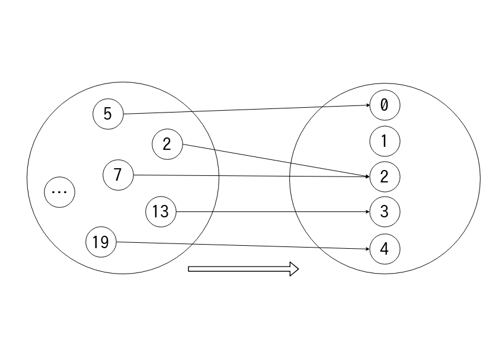
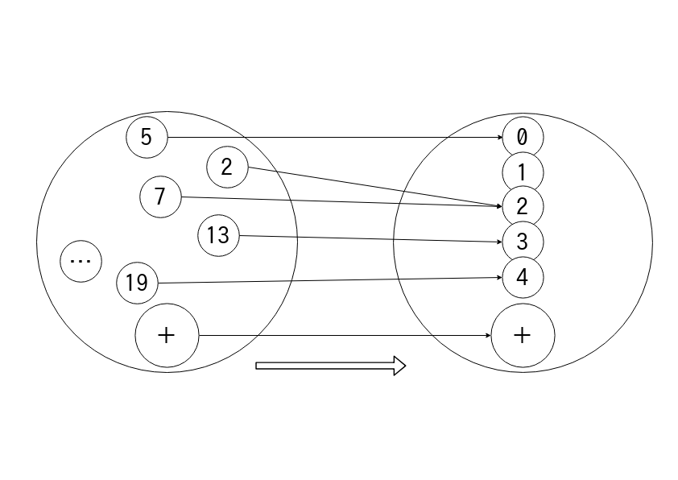
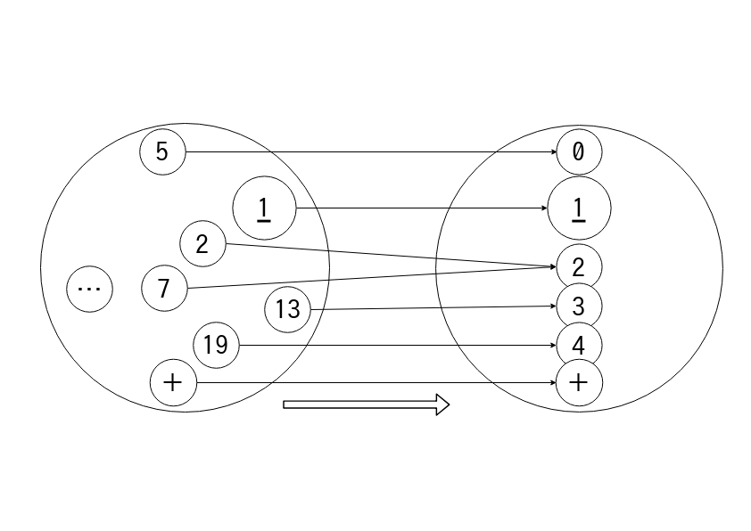
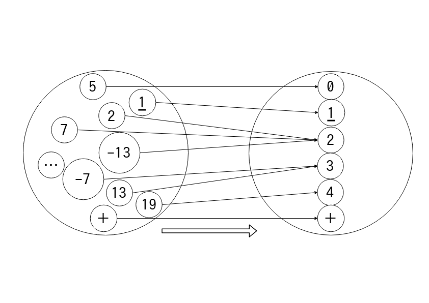
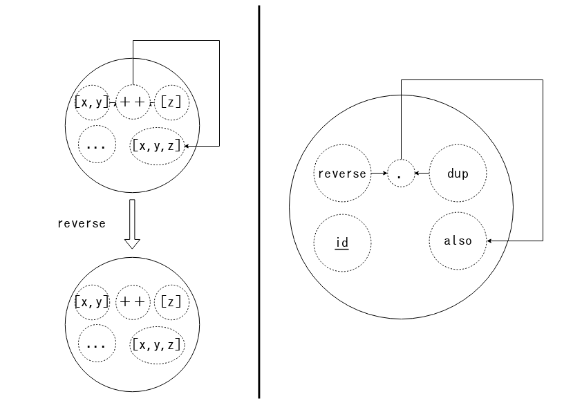

　
# **Semigroupとは？ Monoid？ 環？**
　
### Haskell Day 2018 🤟🙄🤟 aiya000
### https://aiya000.github.io/Maid/haskell-day-2018-algebra

<aside class="notes">
今日は「Semigroupとは？ Monoid？ 環？」ということで、
Haskellでの、
代数という概念についての紹介をさせていただきます。
よろしくお願いします！
</aside>

- - - - -

## 僕


- 名前: aiya000 (あいや)
- Twitter: [pubilc\_ai000ya](https://twitter.com/public_ai000ya)
- GitHub: [aiya000](https://github.com/aiya000)

<aside class="notes">
まずは少しの自己紹介をさせていただきます。
名前は「あいや」と申します。
TwitterとGitHubやらやらで活動をしています。  
じゃあ今日の発表の内容は……
ということで ->
</aside>

- - - - -

# このスライドで
# 学べること

- - - - -

### このスライドで学べること

- 代数の素朴な定義
    - マグマ・**半群**・**モノイド**・**群**
    - 擬環・**環**・**体**

<aside class="notes">
代数の素朴な定義を紹介していきます。  
代数の定義は、
Haskellの型とロジックで記述していきます。  
　  
まず前半はこれらについて、
後半はこれらについて話します。
->
</aside>

- - - - -

### このスライドで学べること

初心者フレンドリーな表現 :relaxed:

<aside class="notes">
今回は精密さ・厳密さよりも、
代数の初心者がわかりやすいような表現を用います。
　  
ここで応用例等の紹介は重視しませんが、
軽く紹介します。  
代数って非常に広く応用されているので、
わざわざ紹介するよりも自身で調べて頂いた方が面白いかな〜と。
->
</aside>

- - - - -

# 本編を始める前に一言

<aside class="notes">
本編を始める前に、最後に一言
</aside>

- - - - -

# 皆さん、安心してください
# この発表中のコードは……

- - - - -

# well-compiledです :sunglasses:

- - - - -

# ここから本編 :point_right:

- - - - -

# 代数の素朴な定義

- - - - -

<!--

```haskell

{-# LANGUAGE FlexibleInstances #-}
{-# LANGUAGE GeneralizedNewtypeDeriving #-}
{-# LANGUAGE StandaloneDeriving #-}
{-# LANGUAGE UndecidableInstances #-}

module FirstHalf where

import Control.Monad (MonadPlus(..), guard)
import Data.Numbers.Primes (primes)
import Data.Ratio (Rational, (%), numerator, denominator)
import Prelude hiding (Semigroup(..), Monoid(..))

```

-->

### 代数の素朴な定義
# マグマ
## (Magma)

<aside class="notes">
一番制約が緩い代数、マグマ。
</aside>

- - - - -

### 代数の素朴な定義 - マグマ

**足し算**（あるいは**掛け算**）  
ができる構造

```
x <> y <> z
```

`<>` ← 足し算（あるいは掛け算）

<aside class="notes">
マグマは足し算あるいは掛け算のような、
いわゆる「構造に閉じた」「二項演算」が行えるものです。  
Haskellで書くと…… ->
</aside>

- - - - -

### 代数の素朴な定義 - マグマ

```haskell
class Magma a where
    (<>) :: a -> a -> a

instance Magma Int where
    (<>) = (+)

instance Magma [a] where
    (<>) = (++)
```

`<>` ← aに閉じた（aの上の）二項演算

<aside class="notes">
こんな感じ。
例えばIntやリストがマグマとして挙げられます。
あとは ->
</aside>

- - - - -

### 代数の素朴な定義 - マグマ

```haskell
instance Magma Bool where
    (<>) = (&&)

instance Magma Float where
    (<>) = (+)

instance Magma () where
    () <> () = ()
```

`<>` ← aに閉じた（aの上の）二項演算

<aside class="notes">
BoolやFloat、Unitなどなど。
</aside>

- - - - -

### 代数の素朴な定義 - マグマ

**閉じた**（**上の**）、**二項演算**？ 🤔

- - - - -

### 代数の素朴な定義 - マグマ

aに閉じた（aの上の）演算とは:

:point_down: このような演算

- `a`の値だけを受け取って
- `a`の値を返す

```
(+) :: Int -> Int -> Int
id  :: Rational -> Rational
```

<aside class="notes">
ここで誤解を恐れず言えば、
Haskellで「演算」とは主に関数のことです。  
なのでaに閉じた演算、aの上の演算とは、
このような関数のことです。  
Intの上の演算+、
Rationalの上の演算idですね。
</aside>

- - - - -

### 代数の素朴な定義 - マグマ

二項演算とは: **2引数の演算**

```
(+)       :: Int -> Int -> Int
(:)       :: a -> [a] -> [a]
fromMaybe :: a -> Maybe a -> a
```

<aside class="notes">
二項演算とは。
これはまあ単純で、
2引数の演算のことです。  
これらは二項演算です。
</aside>

- - - - -

### 代数の素朴な定義 - マグマ

:ok:
Int上の二項演算
:ok_woman:

```
(+) :: Int -> Int -> Int
```

- - -

:no_good:
二項演算ではない
:ng:

```
id :: Rational -> Rational
```

:no_good:
aにも[a]にも閉じていない
:ng:

```
(:) :: a -> [a] -> [a]
```

<aside class="notes">
ということでまとめです。  
Magma aとはa上の、aに閉じた二項演算を持つ構造です。  
Intはそのような+を持つので、
マグマになれます。  
また、下記の2つは閉じた二項演算ではありません。
</aside>

- - - - -

### 代数の素朴な定義 - マグマ

応用例: concatL, concatR

```haskell
concatL :: Magma a => a -> [a] -> a
concatL = foldl (<>)

concatR :: Magma a => a -> [a] -> a
concatR = foldr (<>)
```

その `Magma a` に沿った性質の集約を行う関数 :point_up:

<aside class="notes">
簡素ではありますが、
応用例としてはこのような関数が考えられます。  
例えば先程挙げたIntやFloatなら数の総和を、
Boolなら「全てがTrueであるか否か」を求めます。  
各々の型に対して適宜そのような関数を定義するよりも、
こちらを使った方がわかりやすいですね。
</aside>

- - - - -

# ところで……

- - - - -

## ある型に対してマグマの実装は必ずしも**唯一じゃない**

<aside class="notes">
「ある型に対してマグマの実装は必ずしも唯一じゃない」
んですよね。
例えば ->
</aside>

- - - - -

```
instance Magma Int where
    (<>) = (+)

instance Magma Int where
    (<>) = (*)
```

🤔

<aside class="notes">
Intの足し算も掛け算はどちらもIntについて閉じており、
二項演算でもある。
また ->
</aside>

- - - - -

```
instance Magma Bool where
    (<>) = (||)

instance Magma Bool where
    (<>) = (&&)
```

🤔

<aside class="notes">
Boolについても同様です。  
この「代数は必ずしも型に対して1つだけ定まるわけじゃない」
っていうのは大事なことですね。
ということで ->
</aside>

- - - - -

### 代数の素朴な定義

```haskell
-- 和 ↓
newtype Sum a = Sum
    { unSum :: a
    } deriving (Show, Eq)
-- 積 ↓
newtype Product a = Product
    { unProduct :: a
    } deriving (Show, Eq)
```

<aside class="notes">
適宜newtypeを定義してあげて ->
</aside>

- - - - -

### 代数の素朴な定義

```haskell
deriving instance Num a => Num (Sum a)
deriving instance Num a => Num (Product a)

instance Num a => Magma (Sum a) where
    (<>) = (+)

instance Num a => Magma (Product a) where
    (<>) = (*)
```

<aside class="notes">
それに対してインスタンスを定義してあげましょう。  
これはGeneralizedNewtypeDerivingとStandaloneDerivingを使った、
IntやFloatの新しいインスタンスで ->
</aside>

- - - - -

### 代数の素朴な定義

```haskell
newtype And = And
    { unAnd :: Bool
    } deriving (Show, Eq)

instance Magma And where
    And x <> And y = And $ x && y
```

<aside class="notes">
Boolについても各々のnewtypeを追加していきます。  
Andはこんな感じで、
Orはというと ->
</aside>

- - - - -

### 代数の素朴な定義

```haskell
newtype Or = Or
    { unOr :: Bool
    } deriving (Show, Eq)

instance Magma Or where
    Or x <> Or y = Or $ x || y
```

<aside class="notes">
同様にこんな感じ。
Xorも同じく ->
</aside>

- - - - -

### 代数の素朴な定義

```haskell
newtype Xor = Xor
    { unXor :: Bool
    } deriving (Show, Eq)

instance Magma Xor where
    Xor True  <> Xor False = Xor True
    Xor False <> Xor True  = Xor True
    _ <> _ = Xor False
```

<aside class="notes">
こうですね。  
Unitについてはインスタンスが唯一つなので、
新しく定義はしません。  
……
ってとこで、まず代数の入りは終了です。  
次は ->
</aside>

- - - - -

### 代数の素朴な定義
# 半群
## (Semigroup)

<aside class="notes">
半群という、
もう少し便利な代数に入りたいと思います。
</aside>

- - - - -

### 代数の素朴な定義 - 半群

マグマ + **左右どちらから演算して変わらない**

`(x <> y) <> z` = `x <> (y <> z)`

<aside class="notes">
この性質を満たすことを「結合法則を満たす」と言います。
</aside>

- - - - -

### 代数の素朴な定義 - 半群

マグマ + **左右どちらから演算して変わらない**

```haskell
associativeLaw :: (Semigroup a, Eq a) =>
                  a -> a -> a -> Bool
associativeLaw x y z =
  (x <> y) <> z == x <> (y <> z)
```

- - - - -

### 代数の素朴な定義 - 半群

```haskell
class Magma a => Semigroup a

instance Semigroup (Sum Integer)     -- 10 + 20
instance Semigroup (Product Integer) -- 10 * 20
instance Semigroup (Sum Rational)
instance Semigroup (Product Rational)
 -- (10%20) + (30%40)
 -- (10%20) * (30%40)
```

<!--

```haskell
instance Semigroup [a]
instance Semigroup And
instance Semigroup Or
instance Semigroup Xor
instance Semigroup ()
```

-->

<aside class="notes">
残念ながらFloatやDoubleは丸め誤差によってインスタンスにならないので、
ここでIntegerとRationalに限定にしておきます。
</aside>

- - - - -

### 代数の素朴な定義 - 半群

さっきconcatLとconcatRに分かれてたのが……

```haskell
concat :: Semigroup a => a -> [a] -> a
concat = foldl (<>)
```

<aside class="notes">
結合法則を満たすということは、
左右どちらから演算しても結果が同じということなので、
concatLとRが同じものになります。
</aside>

- - - - -

### 代数の素朴な定義 - 半群

- 応用例:
    - 末尾再帰最適化
    - プログラミング (`Data.Semigroup`)

<!-- TODO: 末尾最適化について詳しく？ -->

- - - - -

### 代数の素朴な定義 - 半群

- マグマであって半群**でない**例
    - Double, Float（浮動小数点数）
    - :point_up: 丸め誤差による制約

<aside class="notes">
コンピューター上の実数の近似である浮動小数点数は半群ではありませんが、
実数は半群になります。
まあコンピューターには真の実数はないので、
ここではインスタンスとして書けませんでした。
</aside>

<!-- 結合法則の最適化 -->
<!-- http://www.kmonos.net/wlog/121.html -->

- - - - -

### 代数の素朴な定義
# モノイド
## (Monoid)

- - - - -

### 代数の素朴な定義 - モノイド

半群 + **単位元** e

`e <> x` = `x` = `x <> e`

- - - - -

### 代数の素朴な定義 - モノイド

半群 + **単位元** empty

```haskell
emptyLaw :: (Monoid a, Eq a) => a -> Bool
emptyLaw x =
  (empty <> x == x) && (x == x <> empty)
```

- - - - -

### 代数の素朴な定義 - モノイド

```haskell
class Semigroup a => Monoid a where
  empty :: a

instance Monoid (Sum Integer) where
  empty = Sum 0

instance Monoid And where
  empty = And True
```

- - - - -

### 代数の素朴な定義 - モノイド

- Sum Integer
    - `0 + _5` = `_5` = `_5 + 0`
    - `0 + _7` = `_7` = `_7 + 0`
    - `0 + 11` = `11` = `11 + 0`

- - - - -

### 代数の素朴な定義 - モノイド

つまり……何？ 🤔

<aside class="notes">
って感じだけど、
ちょっとだけ我慢して応用例を見てみましょう。
</aside>

- - - - -

### 代数の素朴な定義 - モノイド

:new: 今回の応用例 :point_down:

```haskell
mconcat :: Monoid a => [a] -> a
mconcat = foldl (<>) empty
```

さっきまでのやつ :point_down:

```
concat :: Semigroup a => a -> [a] -> a
concat = foldl (<>)
```

- - - - -

### 代数の素朴な定義 - モノイド

例えば

```haskell
sum :: [Sum Integer] -> Sum Integer
sum = mconcat
```

- - - - -

### 代数の素朴な定義 - モノイド

例えば

```haskell
all :: [And] -> And
all = mconcat
```

- - - - -

### 代数の素朴な定義 - モノイド

つまりモノイドは……  
**自明な初期値が定まった構造**

- empty = 自明な初期値

- - - - -

### 代数の素朴な定義 - モノイド

その他インスタンス

```haskell
instance Monoid (Product Integer) where
  empty = Product 1

instance Monoid (Product Rational) where
  empty = Product $ 1 % 1

instance Monoid [a] where
  empty = []
```

- - - - -

### 代数の素朴な定義 - モノイド

その他インスタンス

```haskell
instance Monoid (Sum Rational) where
  empty = Sum $ 0 % 1

instance Monoid Or where
  empty = Or False

instance Monoid Xor where
  empty = Xor False
```

- - - - -

### 代数の素朴な定義 - モノイド

その他インスタンス

```haskell
instance Monoid () where
  empty = ()
```

- - - - -

### 代数の素朴な定義 - モノイド

- 半群であってモノイド**でない**例
    - `NonEmpty a`
    - :point_up: 空リストのような単位元がない

- - - - -

<!-- NOTE: 閑話休題のときは高橋メソッドに切り替えてる。 -->
<!-- （そっちのが皆さん、使う頭が変わって休めるかなと思うので） -->

<!--
TODO: 「MonadPlusは高階なモノイド」という主張の妥当性を確認してもらう。
-->

# 閑話休題

- - - - -

# 皆さん

- - - - -

# Monadは
# お好きですか？

- - - - -

# MonadPlus

- - - - -

### 閑話休題 - MonadPlus

MonadPlus = **Monad** + **Monoid**

（ Alternative = **Applicative** + **Monoid** ）

:arrow_down:

MonadPlusは**高階**な**モノイド**

<aside class="notes">
MonadPlusは実は、高階なモノイドです。  
MonadPlusってなんだっけ……？ っていうと ->
</aside>

- - - - -

### 閑話休題 - MonadPlus

リスト内包記（双子素数）

```haskell
twinPrimes :: [(Int, Int)]
twinPrimes = do
    (x, y) <- zip primes (tail primes)
    guard $ y - x == 2
    return (x, y)
-- [(3,5),(5,7),(11,13),(17,19),(29,31),(41,43), ...]
```

<aside class="notes">
こんな感じのものでした。  
じゃあ「MonadPlusは高階なMonoid」っていうのはどういうことかというと……
まずは定義を見てみましょう ->
</aside>

- - - - -

### 閑話休題 - MonadPlus

```
class Monad m => MonadPlus m where
    mzero :: m a
    mplus :: m a -> m a -> m a
```

<aside class="notes">
これがどのような意味かというと ->
</aside>

- - - - -

### 閑話休題 - MonadPlus

- `MonadPlus (m :: * -> *)`
    - :point_up: 高階 (<code class='no-border'>\* -> \*</code>)
- `mzero`
    - :point_up: <code class='no-border'>m</code>に由来する<code class='no-border'>empty</code>
- `mplus`
    - :point_up: <code class='no-border'>m</code>に由来する<code class='no-border'><></code>

<aside class="notes">
まずmはこのように高階です。  
次にmzeroとmplusはMonoidのemptyとその二項演算に対応しています。  
例えばMaybeインスタンスなら ->
</aside>

- - - - -

### 閑話休題 - MonadPlus

擬似的に書くなら……

- `Monoid (m :: * -> *)`
    - :arrow_right: <code class='no-border'>instance Monoid Maybe</code>
- `mzero :: m`
    - :arrow_right: <code class='no-border'>Nothing :: Maybe</code>
- `mplus :: m -> m -> m`
    - :arrow_right: <code class='no-border'>Nothing mplus Just = Nothing</code>
    - :arrow_right: <code class='no-border'>Just mplus Just = Just</code>

<aside class="notes">
Type -> Typeへの擬似記法として、このように書けます。
mの任意の型引数aに対してのモノイドという感じ。
</aside>

- - - - -

### 閑話休題 - MonadPlus
## MonadPlusは高階なモノイド

- - - - -

### 閑話休題 - MonadPlus
# こんなところにもモノイドが！！

<aside class="notes">
こんなところにもモノイドは応用されているんだよ、
という例でした。
</aside>

- - - - -

### 代数の素朴な定義
# 群
## (Group)

- - - - -

### 代数の素朴な定義 - 群

モノイド + **任意の元に対する逆元** `x^-1`

`x^-1 <> x` = `e` = `x <> x^-1`

- - - - -

### 代数の素朴な定義 - 群

モノイド + **任意の元に対する逆元** `inverse x`

```haskell
inverseLaw :: (Group a, Eq a) => a -> Bool
inverseLaw x =
  (x <> inverse x == empty) && (empty == inverse x <> x)
```

- - - - -

### 代数の素朴な定義 - 群

```haskell
class Monoid a => Group a where
  inverse :: a -> a

instance Group (Sum Integer) where
  inverse = negate

instance Group Xor where
  inverse = id
```

- - - - -

### 代数の素朴な定義 - 群

- モノイドであって群**でない**例
    - `And`
    - `Or`
    - `Product Integer`
    - `Product Rational`
    - `[a]`

<aside class="notes">
群の要請する「逆元の存在」っていうのは結構厳しい制約で、
これを満たせない構造は多いです。  
これらが群になれない原因を見てみましょう ->
</aside>

- - - - -

### 代数の素朴な定義 - 群

これらは以下がないので群になれない

- `And`: `False && inverse False == True`な  
  　　　:point_right: `inverse False`

　

- `Or`: `True || inverse True == False`な  
  　　　:point_right: `inverse True`

- - - - -

### 代数の素朴な定義 - 群

これは以下がないので群になれない

- `[a]`: `[x, y] ++ inverse [x, y] == []`な  
  　　　:point_right: `inverse [x, y]`

- - - - -

### 代数の素朴な定義 - 群

- `Product Integer`:   
  　　例えば`10 * 1/10 == 1`だけど  
  　　:point_right: `1/10`はIntegerではない

　

- `Product Rational`:   
  　　一般に`x/y * y/x == 1/1`っぽいけど  
  　　:point_right: `0/10 * 10/0`がゼロ除算

- - - - -

### 代数の素朴な定義 - 群

応用例

- [ElGamal暗号](https://ja.wikipedia.org/wiki/ElGamal%E6%9A%97%E5%8F%B7)
- [楕円曲線暗号](https://ja.wikipedia.org/wiki/%E6%A5%95%E5%86%86%E6%9B%B2%E7%B7%9A%E6%9A%97%E5%8F%B7)

- - - - -

### 代数の素朴な定義 - 群

その他インスタンス

```haskell
instance Group (Sum Rational) where
  inverse = negate

instance Group () where
  inverse () = ()
```

- - - - -

# ちょっと寄り道 :eyes:

- - - - -

### 代数の素朴な定義
# 可換な代数
## (Abelian)

- - - - -

### 代数の素朴な定義 - 可換な代数

交換法則  
**可換**半群・**可換**モノイド・**可換**群

`x <> y` = `y <> x`

<aside class="notes">
この交換法則を満たす代数を……  
可換半群、あるいはAbelian Semigroup。  
可換モノイド、あるいはAbelian Monoid。  
可換群、あるいはAbelian Groupと言います。
</aside>

- - - - -

### 代数の素朴な定義 - 可換な代数

```haskell
commutativeLaw :: (Abelian a, Eq a) =>
                  a -> a -> Bool
commutativeLaw x y =
  x <> y == y <> x
```

- - - - -

### 代数の素朴な定義 - 可換な代数

```haskell
class Semigroup a => Abelian a

instance Abelian (Sum Integer)
instance Abelian (Product Integer)
instance Abelian (Sum Rational)
instance Abelian (Product Rational)
instance Abelian And
instance Abelian Or
instance Abelian Xor
instance Abelian ()
```

- - - - -

### 代数の素朴な定義 - 可換な代数

応用例

- ユニフィケーションの解法として

```
-- この型付けは妥当か？
1 : ['a', 'b', 'c']
```

出典: [ユニフィケーション - Wikipedia](https://ja.wikipedia.org/wiki/%E3%83%A6%E3%83%8B%E3%83%95%E3%82%A3%E3%82%B1%E3%83%BC%E3%82%B7%E3%83%A7%E3%83%B3)

<aside class="notes">
ユニフィケーションの解法として使われていたのを見たことがあります。
ここでユニフィケーションについて語るとまた時間が必要なので、
割愛させていただきますが、
例えばこんな項の型推論の補助に使われたりします。
</aside>

- - - - -

### 代数の素朴な定義 - 可換な代数

- 半群であって可換半群**でない**例
    - `[a]`
    - :point_up: `[x, y] ++ [z]`等は可換ではないね :eyes:

- - - - -

# ここで前半戦
# 終わり！

- - - - -

### 代数の素朴な定義
# ここまでのまとめ

- - - - -

### 代数の素朴な定義

| マグマ   | 半群　　　　　　 | モノイド | 群　　　　　 |
|----------|------------------|----------|--------------|
| 　`<>`　 | `(x <> y) <> z`  | `e`　    | `x <> inv x` |
|          | `x <> (y <> z)`  |          | `inv x <> x` |

- - - - -

### 代数の素朴な定義

これまでの形 :point_down:

- より強い代数　　=　　**より弱い代数** + **何か**
    - e.g. モノイド　=　　半群 + 単位元

- - - - -

### 代数の素朴な定義

これからの形 :point_down:

- より強い代数 =
    - **より弱い代数** + **より弱い代数** + 何か

- e.g. 擬環 =
    - **群** + **半群** + 分配法則

<aside class="notes">
これからはこの形が多くなります。
</aside>

- - - - -

# というところで
# 早速…… :point_right:

- - - - -

<!--

```haskell
{-# LANGUAGE FlexibleInstances #-}
{-# LANGUAGE GeneralizedNewtypeDeriving #-}
{-# LANGUAGE StandaloneDeriving #-}
{-# LANGUAGE TypeApplications #-}

module LastHalf where

import Data.Ratio (Rational, (%), numerator, denominator)
import Prelude hiding (Semigroup(..), Monoid(..))
import Test.SmallCheck (smallCheck)

newtype Sum a = Sum
    { unSum :: a
    } deriving (Show, Eq)

newtype Product a = Product
    { unProduct :: a
    } deriving (Show, Eq)

deriving instance Num a => Num (Sum a)
deriving instance Num a => Num (Product a)

newtype And = And
    { unAnd :: Bool
    } deriving (Show, Eq)

newtype Or = Or
    { unOr :: Bool
    } deriving (Show, Eq)

newtype Xor = Xor
    { unXor :: Bool
    } deriving (Show, Eq)
```

-->

### 代数の素朴な定義
# 擬環
## (Rng)

- - - - -

### 代数の素朴な定義 - 擬環

（加法）**可換群** + （乗法）**可換半群**

`x (y <> z)` = `xy <> xz`  
`(x <> y) z` = `xz <> yz`

<aside class="notes">
擬環は可換群と可換半群の組み合わせです。
この2つの式は「分配法則」っていいます。
分配法則をHaskellのコードで表すと ->
</aside>

- - - - -

### 代数の素朴な定義 - 擬環

```haskell
distributiveLaw :: (Rng a, Eq a) =>
                   a -> a -> a -> Bool
distributiveLaw x y z =
  x >< (y <> z) == x >< y <> x >< z
    &&
  (x <> y) >< z == x >< z <> y >< z
```

<aside class="notes">
こんな感じです。
この先っぽが内側に向いている方の二項演算子大なり小なりは、
小なり大なりよりも結合優先度が高いことに注意です。  
改めて擬環の定義をしてみましょう ->
</aside>

- - - - -

### 代数の素朴な定義 - 擬環

- 加法 :point_right: 群　`(a, <>, emptyA, inverseA)`
- 乗法 :point_right: 半群`(a, ><)`

```haskell
class Rng a where
    (<>)     :: a -> a -> a
    emptyA   :: a
    inverseA :: a -> a
    (><)     :: a -> a -> a

infixl 6 <>
infixl 7 ><
```

<aside class="notes">
ここで「二項演算><・emptyA・inverseA」の組み合わせを加法、
二項演算<>を乗法って言います。
あとは ->
</aside>

- - - - -

### 代数の素朴な定義 - 擬環

- 加法単位元（**零元**）

```
emptyA :: a
```

- - - - -

### 代数の素朴な定義 - 擬環

つまるところ擬環は……

**分配**をするために  
必要なものを定めたプロトコル🤓

```
2(5 + 2) = 2*5 + 2*2
```

<aside class="notes">
にこにー　にこににー、
になる。
</aside>

- - - - -

### 代数の素朴な定義 - 擬環

```haskell
-- 2 * (5 + 2)  =  2*5 + 2*2
--              =  10 + 4
--              =  14
instance Rng Integer where
    (<>)     = (+)
    emptyA   = 0
    inverseA = negate
    (><)     = (*)
```

<aside class="notes">
足し算についての群が加法、
掛け算についての半群が乗法なので、
加法・乗法という言い回しがストンとくるんじゃないでしょうか。
</aside>

- - - - -

### 代数の素朴な定義 - 擬環

```haskell
instance Rng Rational where
    (<>)       = (+)
    emptyA     = 0 % 1
    inverseA x = denominator x % numerator x
    (><)       = (*)
```

<aside class="notes">
Integerと同じように、
Rationalの定義ができます。
</aside>

- - - - -

### 代数の素朴な定義 - 擬環

```haskell
-- True && (False `xor` True)
--      = (True&&False) `xor` (True&&True)
--      = True
instance Rng Bool where
    (<>)     = xor
    emptyA   = False
    inverseA = id
    (><)     = (&&)
```

<!--

```haskell
xor :: Bool -> Bool -> Bool
xor True False = True
xor False True = True
xor _ _ = False
```

-->

- - - - -

### 代数の素朴な定義 - 擬環

い　つ　も　の

```haskell
instance Rng () where
    () <> ()    = ()
    emptyA      = ()
    inverseA () = ()
    () >< ()    = ()
```

- - - - -

### 代数の素朴な定義
# 環
## (Ring)

<aside class="notes">
擬環に少しの概念を加えた代数として、
環っていうのもあります。
</aside>

- - - - -

### 代数の素朴な定義 - 環

加法**可換群** + 乗法**可換モノイド**

:arrow_up_down:

擬環 + 乗法**単位元** 1

`1 (x <> y) z` = `(x <> y) z`  
`x (y <> z) 1` = `x (y <> z)`

- - - - -

### 代数の素朴な定義 - 環

擬環 + 乗法**単位元** emptyM

```haskell
emptyLawForMulti :: (Ring a, Eq a) => a -> Bool
emptyLawForMulti x =
  (x >< emptyM == x) && (x == emptyM >< x)
```

- - - - -

### 代数の素朴な定義 - 環

```haskell
class Rng a => Ring a where
    emptyM :: a
```

- - - - -

### 代数の素朴な定義 - 環

```haskell
instance Ring Integer where
    emptyM = 1

instance Ring Rational where
    emptyM = 1 % 1
```

- - - - -

### 代数の素朴な定義 - 環

```haskell
instance Ring Bool where
    emptyM = True

instance Ring () where -- 🤓
    emptyM = ()
```

- - - - -

# またちょっと
# 休憩 :sleeping:

- - - - -

# 皆さん

- - - - -

# 写像は
# 好きですか？

- - - - -

# Q. 写像ってなに？

- - - - -

## A. こういうの



- - - - -

## 半群準同型写像



- - - - -

### 休憩 - 半群準同型写像

**半群準同型**`f : a -> b`とは

:arrow_down:

`Semigroup a`, `<!> :: a -> a -> a`

`Semigroup b`, `<?> :: b -> b -> b`

があるときに

- - - - -

### 休憩 - 半群準同型写像

:arrow_down:

`a`の全ての値 `x :: a`, `y :: a` を

`f (x <!> y) :: b` = `f x <?> f y :: b`
にする  
`f` のことである :relieved:

- - - - -

### 休憩 - 半群準同型写像

<!--

```haskell
class Magma a where
    (<+>) :: a -> a -> a

class Magma a => Semigroup a

instance Magma [a] where
    (<+>) = (++)

instance Semigroup [a]

instance Magma Int where
    (<+>) = (+)

instance Semigroup Int

(<!>) :: Semigroup b => b -> b -> b
(<!>) = (<!>)

(<?>) :: Semigroup b => b -> b -> b
(<?>) = (<!>)
```

-->

2つのSemigroup `a`, `b` の区別 :eyes:

```
(<!>) :: Semigroup a => a -> a -> a
(<!>) = (<>)

(<?>) :: Semigroup b => b -> b -> b
(<?>) = (<>)
```

- - - - -

### 休憩 - 半群準同型写像

```haskell
newtype Homo a b = Homo
    { runHomo :: a -> b
    }

listAToInt :: Homo [a] Int
listAToInt = Homo length
```

:point_up: `Semigroup [a]` と `Semigroup Int` は準同型

- - - - -

### 休憩 - 半群準同型写像

```haskell
homoLaw :: ( Semigroup a, Eq a
           , Semigroup b, Eq b
           ) => Homo a b -> a -> a -> Bool
homoLaw (Homo f) x y =
    f (x <!> y) == f x <?> f y
```

<!--

```haskell
checkListAToInt :: IO ()
checkListAToInt = smallCheck 5 . homoLaw $ listAToInt @ [()]
```

-->

- - - - -

## モノイド準同型写像



- - - - -

## 群準同型写像



- - - - -

# 実は……

- - - - -

# 自己準同型写像と
# その合成は
# **モノイドになる**

- - - - -

### 休憩 - 自己準同型写像と合成はモノイドになる

<!--

```haskell
class Semigroup a => Monoid a where
  empty :: a

instance Magma (Homo a a) where
    (Homo f) <+> (Homo g) = Homo $ f . g

instance Semigroup (Homo a a)

instance Monoid (Homo a a) where
    empty = Homo id
```

-->

```
instance Magma (Homo a a) where
    (Homo f) <> (Homo g) = Homo $ f . g

instance Semigroup (Homo a a)

instance Monoid (Homo a a) where
    empty = Homo id
```

- - - - -

### 休憩 - 自己準同型写像と合成はモノイドになる

```haskell
reverseHomo :: Homo [a] [a]
reverseHomo = Homo reverse
-- >>> runHomo listATolistA' [1..5]
-- [1,2,2,3,3,4,4,5]
duplicateHomo :: Homo [a] [a]
duplicateHomo = Homo $ \xs ->
    zip xs (tail xs) >>= \(t, u) -> t : u : []
-- ... and more `Homo [a] [a]` values ...
```

<aside class="notes">
この内容は理解しないで大丈夫です。
これらが準同型写像として型付けられてることに注視してください。
</aside>

- - - - -

### 休憩 - 自己準同型写像と合成はモノイドになる

<!--

```haskell
reverseHomo' :: Homo [a] [a]
reverseHomo' = empty <+> reverseHomo

reverseHomo'' :: Homo [a] [a]
reverseHomo'' = reverseHomo <+> empty

alsoHomo :: Homo [a] [a]
alsoHomo = reverseHomo <+> duplicateHomo
```

-->

```
reverseHomo' :: Homo [a] [a]
reverseHomo' = empty <> reverseHomo
reverseHomo'' :: Homo [a] [a]
reverseHomo'' = reverseHomo <> empty

alsoHomo :: Homo [a] [a]
alsoHomo = reverseHomo <> duplicateHomo
-- ... and forall `Homo [a] [a]` ...
```

- - - - -

### 休憩 - 自己準同型写像と合成はモノイドになる



- - - - -

# **全ての道は**
# **モノイドに通ず**

<aside class="notes">
皆さん是非、
この言葉をおみやげに持ち帰ってください。
</aside>

- - - - -

### 代数の素朴な定義
# 体
## (Field)

- - - - -

### 代数の素朴な定義 - 体

加法**可換群** + 乗法**可換群（※）**

:arrow_up_down:

環 + `0 ≠ 1` + **乗法逆元**

`x <> y`, `x <> inv y`  
`x >< y`, `x >< inv y`

- - -

※ **0を除く**

- - - - -

### 代数の素朴な定義 - 体

## :point_right: 四則演算ができる

- - - - -

### 代数の素朴な定義 - 体

```haskell
class Ring a => Field a where
  inverseM :: a -> a
```

- - - - -

### 代数の素朴な定義 - 体

- `0 ≠ 1`
    - 加法単位元`0`　　 ≠ 乗法単位元`1`
    - 加法単位元`emptyA` ≠ 乗法単位元`emptyM`

```haskell
emptyDifferenceLaw :: forall a.
                      (Field a, Eq a) => Bool
emptyDifferenceLaw =
    (emptyM :: a) /= (emptyA :: a)
```

- - - - -

### 代数の素朴な定義 - 体

乗法逆元

```haskell
inverseLawForMulti :: (Field a, Eq a) => a -> Bool
inverseLawForMulti x
  | x == emptyA = True -- 「0を除く」
  | otherwise =
        (x >< inverseM x == emptyM) &&
        (inverseM x >< x == emptyM)
```

- - - - -

### 代数の素朴な定義 - 体

乗法可換群（※0を除く）

e.g. Rational なら 群`(R', *, 1/1)` のこと

```
R' = { ..., -2/3, ...
     , -1/3, ..., 1/3
     , ..., 2/3, ...
     }
```

R'に `0/1` (`0`, `emptyA`) がないことに注意

- - - - -

### 代数の素朴な定義 - 体

**四則演算**ができる

|        |              |
|--------|--------------|
| 足し算 | `x <> y`     |
| 引き算 | `x <> inv y` |
| 掛け算 | `x >< y`     |
| 割り算 | `x >< inv y` |

- - - - -

### 代数の素朴な定義 - 体

| 　　　　　　　　                                  | 　　　　　　　  | 　　　　　　  |
|---------------------------------------------------|-----------------|---------------|
| 足し算 = <code class='no-border'>x + y</code>     | `3/2 + 1/2`     | = `4/2`       |
| 引き算 = <code class='no-border'>x + -y</code>    | `3/2 + -1/2`    | = `2/2`       |
| 掛け算 = <code class='no-border'>x \* w/v</code>  | `3/2 * 1/2`     | = `3/4`       |
| 割り算 = 　:arrow_down:                           | `3/2 * inv 1/2` | = `3/2 * 2/1` |
| 　　　<code class='no-border'>x \* inv w/v</code> |                 | = `6/2`       |

- - -

:point_up: Field Rational :point_up_2:

- - - - -

### 代数の素朴な定義 - 体

「0を除く」

これをやらないと`0 = 1`になり全てが`0`になる


- - - - -

# 今日の内容は
# ここまで！

- - - - -

# お疲れ様でした
# ✋😊

- - - - -

# まとめ

- - - - -

## このスライドで学んだこと

- 代数の素朴な定義
    - マグマ・**半群**・**モノイド**・**群**
    - 擬環・**環**・**体**

- - - - -

## このスライドで学んだこと

- **プログラミングで応用**が盛んな代数
    - マグマ・半群・モノイド

- **数学等々**で応用が盛んな代数
    - 群・擬環・環・体

（必ずしもこの限りではない🤔）

- - - - -

[https://aiya000.booth.pm/items/1040121](https://aiya000.booth.pm/items/1040121)

「今回話したこと + もうちょっとわかりやすい説明」を教えてくれる本
🤟🙄🤟

<aside class="notes">
今回話したことと同じようなことを、
わかりやすく説明した本をデジタル販売しているので、
もしよければお求めください。
</aside>

- - - - -

# おわり


<aside class="notes">
以上で発表を終わります。
ご清聴ありがとうございました。
</aside>
