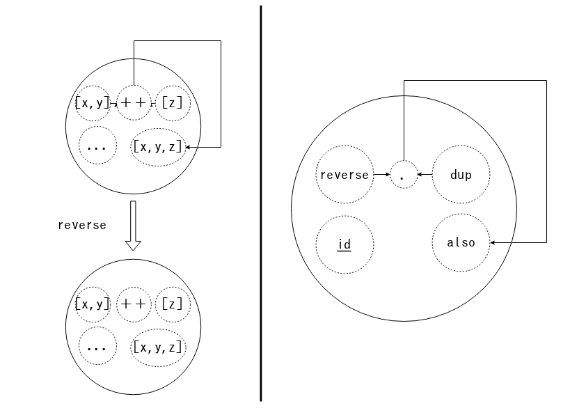

# ちょっと
# 脱線 :sleeping:

<aside class="notes">
ここでちょっとだけ脱線してみましょう。
</aside>

- - - - -

# 皆さん

- - - - -

# 写像は
# 好きですか？

- - - - -

# Q. 写像ってなに？

<aside class="notes">
写像が何かと言うと ->
</aside>

- - - - -

## A. こういうの


<aside class="notes">
こういうのがあります。  
ここでちょっと新しい概念として ->
</aside>

- - - - -

## 半群準同型写像


<aside class="notes">
半群準同型写像というものを導入します。
半群準同型写像とは ->
</aside>

- - - - -

### 脱線 - 半群準同型写像

**半群準同型**`f : a -> b`とは

:arrow_down:

`Semigroup a`, `<!> :: a -> a -> a`

`Semigroup b`, `<?> :: b -> b -> b`

があるときに

<aside class="notes">
まず2つの半群について考えるので、二項演算を!と?で区別します。  
そして半群a,bがあったときに ->
</aside>

- - - - -

### 脱線 - 半群準同型写像

:arrow_down:

<code class='no-border'>a</code>の全ての値
<code class='no-border'>x :: a</code>,
<code class='no-border'>y :: a</code>を

`f (x <!> y)` = `f x <?> f y`
にする  
<code class='no-border'>f</code> のことである :relieved:

<aside class="notes">
各値をこのように保存するfです。  
なんのこっちゃって感じだと思うので、
そういうときはHaskellで書いてみましょう。
</aside>

- - - - -

### 脱線 - 半群準同型写像

<!--

```haskell
class Magma a where
    (<+>) :: a -> a -> a

class Magma a => Semigroup a

instance Magma [a] where
    (<+>) = (++)

instance Semigroup [a]

instance Magma Int where
    (<+>) = (+)

instance Semigroup Int

(<!>) :: Semigroup b => b -> b -> b
(<!>) = (<!>)

(<?>) :: Semigroup b => b -> b -> b
(<?>) = (<!>)
```

-->

2つのSemigroup `a`, `b` の区別 :eyes:

```hs
(<!>) :: Semigroup a => a -> a -> a
(<!>) = (<>)

(<?>) :: Semigroup b => b -> b -> b
(<?>) = (<>)
```

<aside class="notes">
まず前述の通り、
ある半群aとbを区別して ->
</aside>

- - - - -

### 脱線 - 半群準同型写像

```haskell
newtype Homo a b = Homo
    { runHomo :: a -> b
    }

listAToInt :: Homo [a] Int
listAToInt = Homo length
```

:point_up: `Semigroup [a]` と `Semigroup Int` は準同型

<aside class="notes">
半群準同型写像を表すnewtypeとしてHomoというものを定義します。  
そしてリストの半群からIntの半群への準同型写像、
listAToIntも定義します。  
このlistAToIntは ->
</aside>

- - - - -

### 脱線 - 半群準同型写像

```haskell
homoLaw :: ( Semigroup a, Eq a
           , Semigroup b, Eq b
           ) => Homo a b -> a -> a -> Bool
homoLaw (Homo f) x y =
    f (x <!> y) == f x <?> f y
```

<!--

```haskell
checkListAToInt :: IO ()
checkListAToInt = smallCheck 5 . homoLaw $ listAToInt @ [()]
```

-->

<aside class="notes">
この法則を満たします。
……
というのが半群準同型写像でした。  
ここでこれをモノイドや群に拡張した準同型写像も存在します。
->
</aside>

- - - - -

## モノイド準同型写像


- - - - -

## 群準同型写像


<aside class="notes">
というところで実は……
</aside>

- - - - -

# 実は……

- - - - -

# 自己準同型写像と
# その合成は
# **モノイドになる**

<aside class="notes">
自己準同型写像とその合成はまたモノイドになります。
自己準同型写像とは ->
</aside>

- - - - -

### 脱線 - 自己準同型写像と合成はモノイドになる

<!--

```haskell
class Semigroup a => Monoid a where
  empty :: a

instance Magma (Homo a a) where
    (Homo f) <+> (Homo g) = Homo $ f . g

instance Semigroup (Homo a a)

instance Monoid (Homo a a) where
    empty = Homo id
```

-->

```hs
instance Magma (Homo a a) where
    (Homo f) <> (Homo g) = Homo $ f . g

instance Semigroup (Homo a a)

instance Monoid (Homo a a) where
    empty = Homo id
```

<aside class="notes">
同一の半群、
aからaへの準同型写像です。  
そしてそれはMonoidのインスタンスになります。
確認してみましょう。
->
</aside>

- - - - -

### 脱線 - 自己準同型写像と合成はモノイドになる

```haskell
reverseHomo :: Homo [a] [a]
reverseHomo = Homo reverse
-- >>> runHomo listATolistA' [1..5]
-- [1,2,2,3,3,4,4,5]
duplicateHomo :: Homo [a] [a]
duplicateHomo = Homo $ \xs ->
    zip xs (tail xs) >>= \(t, u) -> [t, u]
-- ... and more `Homo [a] [a]` values ...
```

<aside class="notes">
リストの自己準同型写像を2つ定義してみます。  
この内容は理解しないで大丈夫です。
これらが準同型写像として型付けられてることに注視してください。  
そしてこれらは ->
</aside>

- - - - -

### 脱線 - 自己準同型写像と合成はモノイドになる

<!--

```haskell
reverseHomo' :: Homo [a] [a]
reverseHomo' = empty <+> reverseHomo

reverseHomo'' :: Homo [a] [a]
reverseHomo'' = reverseHomo <+> empty

alsoHomo :: Homo [a] [a]
alsoHomo = reverseHomo <+> duplicateHomo
```

-->

```hs
reverseHomo' :: Homo [a] [a]
reverseHomo' = empty <> reverseHomo
reverseHomo'' :: Homo [a] [a]
reverseHomo'' = reverseHomo <> empty

alsoHomo :: Homo [a] [a]
alsoHomo = reverseHomo <> duplicateHomo
-- ... and forall `Homo [a] [a]` ...
```

<aside class="notes">
このように、
結合法則と単位元の法則を満たした、
新しい自己準同型写像を作ることができます。
イメージは ->
</aside>

- - - - -

### 脱線 - 自己準同型写像と合成はモノイドになる



<aside class="notes">
こんな感じです。  
reverseはリストの自己準同型写像で、
それはつまりリスト自己準同型写像モノイドの値ということです。  
ここで大事な言葉意があります。
->
</aside>

- - - - -

# **全ての道は**
# **モノイドに通ず**

<aside class="notes">
皆さん是非、
この言葉をおみやげに持ち帰ってください。
</aside>
