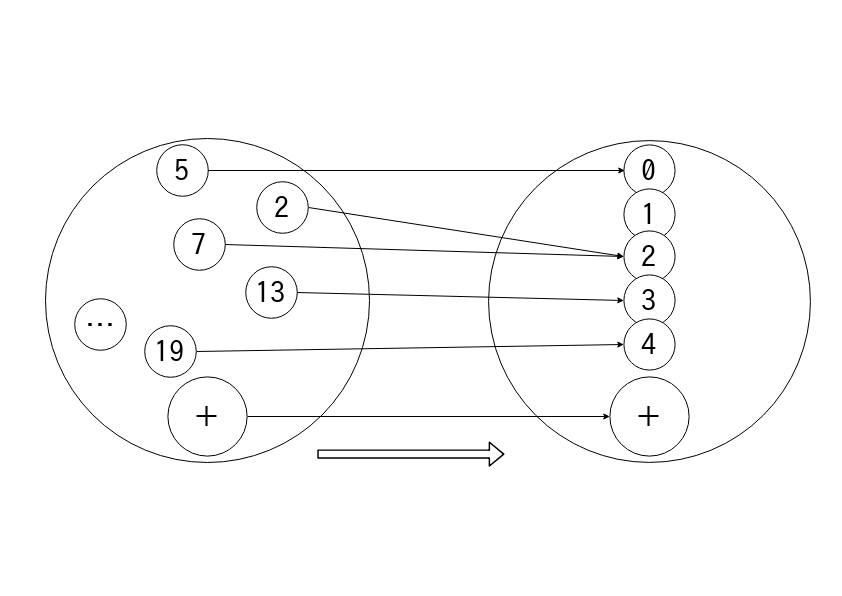

# ちょっと
# 脱線 :sleeping:

- - - - -

# 皆さん

- - - - -

# 写像は
# 好きですか？

- - - - -

# Q. 写像ってなに？

- - - - -

## A. こういうの


- - - - -

## 半群準同型写像



- - - - -

### 脱線 - 半群準同型写像

**半群準同型**`f : a -> b`とは

:arrow_down:

`Semigroup a`, `<!> :: a -> a -> a`

`Semigroup b`, `<?> :: b -> b -> b`

があるときに

- - - - -

### 脱線 - 半群準同型写像

:arrow_down:

`a`の全ての値 `x :: a`, `y :: a` を

`f (x <!> y) :: b` = `f x <?> f y :: b`
にする  
`f` のことである :relieved:

- - - - -

### 脱線 - 半群準同型写像

<!--

```haskell
class Magma a where
    (<+>) :: a -> a -> a

class Magma a => Semigroup a

instance Magma [a] where
    (<+>) = (++)

instance Semigroup [a]

instance Magma Int where
    (<+>) = (+)

instance Semigroup Int

(<!>) :: Semigroup b => b -> b -> b
(<!>) = (<!>)

(<?>) :: Semigroup b => b -> b -> b
(<?>) = (<!>)
```

-->

2つのSemigroup `a`, `b` の区別 :eyes:

```hs
(<!>) :: Semigroup a => a -> a -> a
(<!>) = (<>)

(<?>) :: Semigroup b => b -> b -> b
(<?>) = (<>)
```

- - - - -

### 脱線 - 半群準同型写像

```haskell
newtype Homo a b = Homo
    { runHomo :: a -> b
    }

listAToInt :: Homo [a] Int
listAToInt = Homo length
```

:point_up: `Semigroup [a]` と `Semigroup Int` は準同型

- - - - -

### 脱線 - 半群準同型写像

```haskell
homoLaw :: ( Semigroup a, Eq a
           , Semigroup b, Eq b
           ) => Homo a b -> a -> a -> Bool
homoLaw (Homo f) x y =
    f (x <!> y) == f x <?> f y
```

<!--

```haskell
checkListAToInt :: IO ()
checkListAToInt = smallCheck 5 . homoLaw $ listAToInt @ [()]
```

-->

- - - - -

## モノイド準同型写像


- - - - -

## 群準同型写像


- - - - -

# 実は……

- - - - -

# 自己準同型写像と
# その合成は
# **モノイドになる**

- - - - -

### 脱線 - 自己準同型写像と合成はモノイドになる

<!--

```haskell
class Semigroup a => Monoid a where
  empty :: a

instance Magma (Homo a a) where
    (Homo f) <+> (Homo g) = Homo $ f . g

instance Semigroup (Homo a a)

instance Monoid (Homo a a) where
    empty = Homo id
```

-->

```hs
instance Magma (Homo a a) where
    (Homo f) <> (Homo g) = Homo $ f . g

instance Semigroup (Homo a a)

instance Monoid (Homo a a) where
    empty = Homo id
```

- - - - -

### 脱線 - 自己準同型写像と合成はモノイドになる

```haskell
reverseHomo :: Homo [a] [a]
reverseHomo = Homo reverse
-- >>> runHomo listATolistA' [1..5]
-- [1,2,2,3,3,4,4,5]
duplicateHomo :: Homo [a] [a]
duplicateHomo = Homo $ \xs ->
    zip xs (tail xs) >>= \(t, u) -> [t, u]
-- ... and more `Homo [a] [a]` values ...
```

<aside class="notes">
この内容は理解しないで大丈夫です。
これらが準同型写像として型付けられてることに注視してください。
</aside>

- - - - -

### 脱線 - 自己準同型写像と合成はモノイドになる

<!--

```haskell
reverseHomo' :: Homo [a] [a]
reverseHomo' = empty <+> reverseHomo

reverseHomo'' :: Homo [a] [a]
reverseHomo'' = reverseHomo <+> empty

alsoHomo :: Homo [a] [a]
alsoHomo = reverseHomo <+> duplicateHomo
```

-->

```hs
reverseHomo' :: Homo [a] [a]
reverseHomo' = empty <> reverseHomo
reverseHomo'' :: Homo [a] [a]
reverseHomo'' = reverseHomo <> empty

alsoHomo :: Homo [a] [a]
alsoHomo = reverseHomo <> duplicateHomo
-- ... and forall `Homo [a] [a]` ...
```

- - - - -

### 脱線 - 自己準同型写像と合成はモノイドになる


- - - - -

# **全ての道は**
# **モノイドに通ず**

<aside class="notes">
皆さん是非、
この言葉をおみやげに持ち帰ってください。
</aside>
