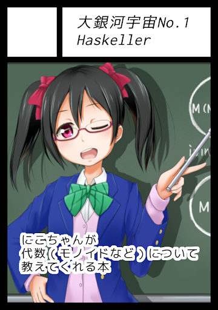

## Haskellで依存型と
## コンパイル時
## インラインlisp
## 🤘😋🤘

- aiya000
- https://github.com/aiya000/hs-zuramaru

- - - - -

## 僕


- 名前: aiya000 (あいや・public_ai000ya)
- Twitter: [pubilc\_ai000ya](https://twitter.com/public_ai000ya)
- GitHub: [aiya000](https://github.com/aiya000)

- - - - -

## 技術書典5 か74

当選しました、よろしくお願いします 🤘🙄🤘

[](https://techbookfest.org/event/tbf05/circle/43260001)

- [サークルページ](https://techbookfest.org/event/tbf05/circle/43260001)

- - - - -

## 今日の内容

__Haskellでの依存型のすごいところ__  
（一例の紹介）

1. 自作Lisp処理系
1. Haskellの依存型の概要
1. Haskellの依存型 + 自作Lisp処理系
    - = __コンパイル時インラインLisp__

- - - - -

## 今日の内容

Haskellでの依存型のすごいところ

コンパイル時に…

- __Lispコードの実行__ &  
  コンパイルエラー化
- その実行結果を  
  __Haskellコードに埋め込み__

- - - - -

# 自作Lisp処理系（[zuramaru](https://github.com/aiya000/hs-zuramaru)）

- - - - -

## 自作Lisp処理系（[zuramaru](https://github.com/aiya000/hs-zuramaru)）

```
$ stack exec maru

zuramaru> (+ 10 20)
30

zuramaru> '(10 20)
(10 20)

zuramaru> (def! x 10)
10

zuramaru> x
10
```

- - - - -

## 自作Lisp処理系（[zuramaru](https://github.com/aiya000/hs-zuramaru)）

```
zuramaru> (print 'hello)
hello()
     ^^ REPLが表示した戻り値（nil）
^^^^^ 出力（hello）

zuramaru> (let* (x 10) x)
10

zuramaru> ((fn* (a) (+ a 100)) 200)
300

zuramaru> (if nil 5 15)
15
```

- - - - -

## 自作Lisp処理系（[zuramaru](https://github.com/aiya000/hs-zuramaru)）

```
zuramaru> (do (def! id (fn* (a) a)) (print (id 252)))
252()

zuramaru> (id 72)
72
```

- - - - -

## 自作Lisp処理系（[zuramaru](https://github.com/aiya000/hs-zuramaru)）

再帰以外ひと通りできる

# 🤔

- - - - -

# __便利__

- - - - -

# Haskellの依存型

- - - - -

## Haskellの依存型

`DataKinds`

```haskell
print $ natVal (Proxy :: Proxy 10)

print $ natVal (Proxy :: Proxy (20 + 30))

putStrLn $ symbolVal (Proxy :: Proxy "poi")
```

- - - - -

## Haskellの依存型

```haskell
-- 型10から値10を抜き出し
natVal (Proxy :: Proxy 10)

-- 自然数の型レベル計算(+)
natVal (Proxy :: Proxy (20 + 30))

-- 文字列も使える
symbolVal (Proxy :: Proxy "poi")
```

- - - - -

# __便利__

- - - - -

## Haskellの依存型

`DataKinds` * singleton types

```haskell
x :: Sing (BarT 10)
x = sing

y :: Sing (BazT "sugar")
y = sing
```

- - - - -

## Haskellの依存型

`DataKinds` * singleton types

```haskell
data FooK = BarT Nat
          | BazT Symbol

newtype instance Sing (BarT n) = Bar Integer
newtype instance Sing (BazT s) = Baz String

instance KnownNat n => SingI (BarT n) where
  sing :: (Sing (BarT n) :: *)
  sing = Bar $ natVal (Proxy :: Proxy n)

instance KnownSymbol s => SingI (BazT s) where
  sing :: (Sing (BazT s) :: *)
  sing = Baz $ symbolVal (Proxy :: Proxy s)
```

- - - - -

# __便利__

- - - - -

# Haskellの依存型
# +
# 自作Lisp処理系

- - - - -

## Haskellの依存型 + 自作Lisp処理系

再帰を実装してない → 自作Lisp処理系

↑
無限再帰しないから  
__多分__コンパイルが停止するし  
__便利__🤔

- - - - -

## Haskellの依存型 + 自作Lisp処理系

- レベル1:  
  __コンパイル時Lispコードパーサー__
    - コンパイル時にASTを展開

- コードを（依存）型に解釈する
- コードが異常なら__コンパイルエラー__

- - - - -

## Haskellの依存型 + 自作Lisp処理系

```haskell
                         これは型！
                      vvvvvvvvvvvvvvvv
>>> fromSing (sing :: Sing [parse|10|])
AtomInt 10

>>> fromSing (sing :: Sing [parse|x|])
AtomSymbol "x"
```

- - - - -

## Haskellの依存型 + 自作Lisp処理系

```haskell
>>> fromSing (sing :: Sing [parse|'x|])
Quote (AtomSymbol "x")

>>> fromSing (sing :: Sing [parse|(1 2 3)|])
Cons (AtomInt 1)
    (Cons (AtomInt 2)
    (Cons (AtomInt 3) Nil))
```

- - - - -

## Haskellの依存型 + 自作Lisp処理系

これくらいならできて当然のコンパイル時処理やろ🤔

- - - - -

## Haskellの依存型 + 自作Lisp処理系

- レベルn:  
  __コンパイル時Lisp処理__
    - コンパイル時にコードを実行

- コンパイル時IO
- 実行の結果を（依存）型に解釈する
- 実行が失敗したら__コンパイルエラー__

- - - - -

## Haskellの依存型 + 自作Lisp処理系

```haskell
>>> fromSing (sing :: Sing [zura|'(10)|])
Cons (AtomInt 10) Nil

>>> fromSing (sing :: Sing [zura|(print 10)|])
10Nil
  ^^^ fromSingの結果
^^
コンパイル時に出力された "10"
```

- - - - -

## zuramaru + 依存型

- 実行が失敗したらコンパイルエラー

```haskell
>>> fromSing (sing :: Sing [zura|(10)|])

error:
- Maru.QQ.zura: an error is occured
    in the compile time: EvalException:
"expected a symbol of either a function or a macro,
    but got `10` in `(10)`"
- In the quasi-quotation: [zura|(10)|]
```

- - - - -

## 今日の内容

Haskellでの依存型すごくないですか？

- コンパイル時に__Lispコードの実行__ &  
  異常のチェック
- Lispコードの実行結果を  
  __Haskellコードに埋め込み__

- - - - -

## おわり
技術書典5 か74よろしく！
🤘🙄🤘

[](https://techbookfest.org/event/tbf05/circle/43260001)
