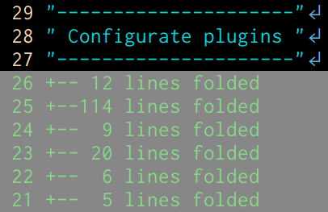
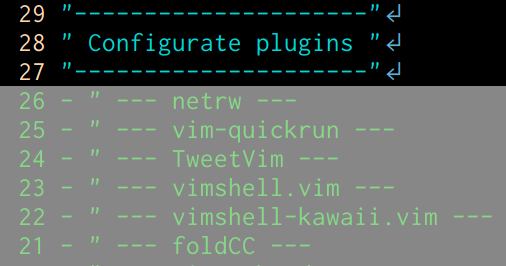
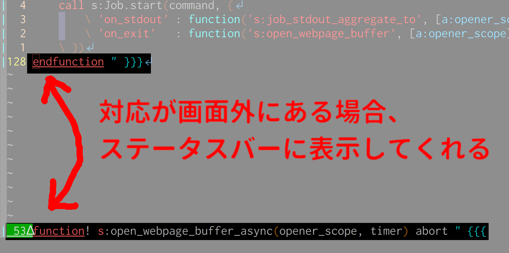
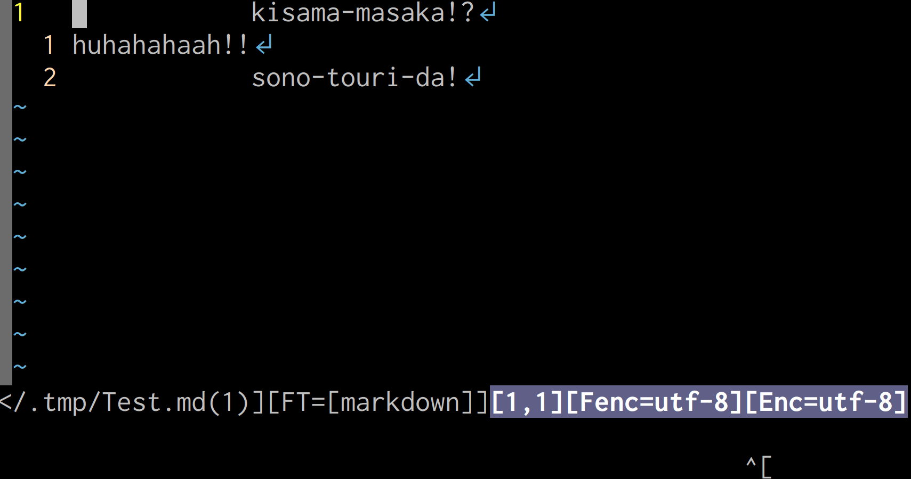
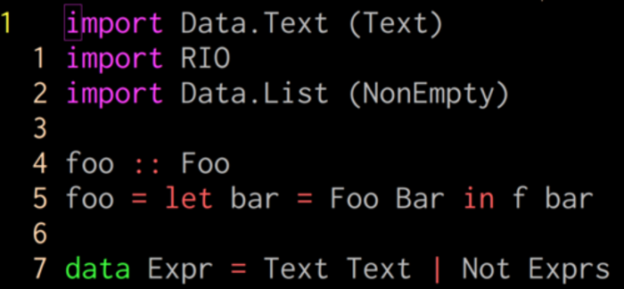
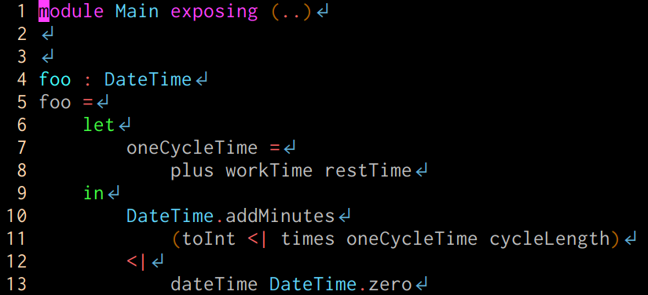
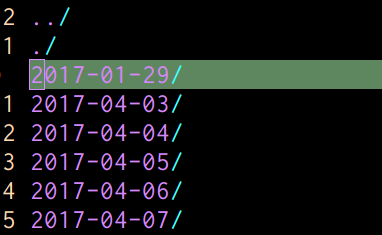
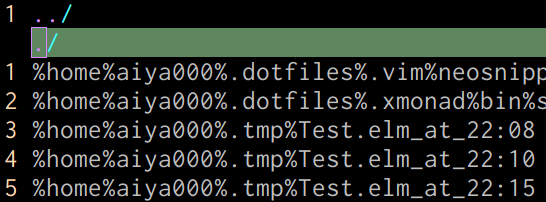
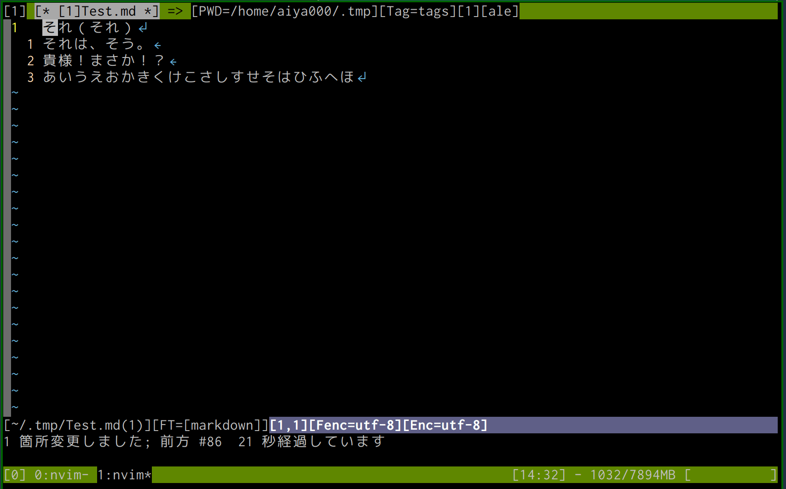

## 僕の推し
## Vimプラグインを見て！
　
#### .vimconf.swp.2018 🤟🙄🤟 aiya000
### https://aiya000.github.io/Maid/vimconf.swp.2018

- - - - -

## 僕


- 推しVim: **NeoVim**
- 名前: aiya000 (あいや)
- Twitter: [pubilc\_ai000ya](https://twitter.com/public_ai000ya)
- GitHub: [aiya000](https://github.com/aiya000)

- - - - -

# 今日の内容

- - - - -

### 今日の内容

Vimプラグインの紹介

<aside class="notes">
僕がお世話になっているVimプラグインの紹介。
</aside>

- - - - -

### 今日の内容

- 見た目編
- 編集編
- 独自機能編
- 自作プラグイン

<aside class="notes">
## 見た目系  
Vimの見た目を格好良く、
または通常見えないものを可視化するようなプラグインについて。  
　  
## 編集編  
Vimの操作を拡張するようなプラグイン。  
Vimmerの皆さんが一番大好きそう。  
　  
## 独自機能編  
例えばVim上でgit操作をできるようにしたり、
従来できなかった、やりにくかったことを容易にできるようにするもの。  
　  
## 自作プラグイン  
なぜ作ったのか、
どこらへんに拘ったのかなど。
</aside>

- - - - -

# 見た目編

<aside class="notes">
ここから本編。  
まずは見た目についてのプラグイン。
</aside>

- - - - -

# LeafCage/foldCC

- - - - -

### LeafCage/foldCC

Vimの**畳み込み**をしたときの  
表示をわかりやすくしてくれる

```
# 畳み込みとは🙄
{{{
　ここらへんがサマリー1行で
表示される機能（マーカー折りたたみ）。
　その他region設定済みの言語では
メソッドをサマリー1行で表示したり……などなど、
色んな方法で折りたたみできる！
}}}
```

<aside class="notes">
もしかしたら知らない方もいるかもしれないですが、
Vimには畳み込みという機能が付いていて……  

こんな感じ（ここで次へ） ->
</aside>

- - - - -

### LeafCage/foldCC

<p class="left">
before :point_down:
</p>




<p class="right">
:point_up: after
</p>

<aside class="notes">
従来の表示が左、
foldCCでの表示が右。  
見ての通り素晴らしい。  
　  
例えばScalaやC#などの構文でメソッドごとの折りたたみを設定すると、  
見やすすぎて「「最強」」になる。  
　  
Vim初心者にこそ使ってみて欲しい。
</aside>

- - - - -

# andymass/
# vim-matchup

- - - - -

### andymass/vim-matchup

matchpair（括弧の対応付け）を  
**括弧やワードの対応付け**に  
拡張してくれる。

```vim
function s:f() abort
" ↑
" 例えば 'function' の上にカーソルを置いて
" % キーを押すと 'endfunction' の上に瞬間移動できる
" ↓
endfunction
```

- - - - -

### andymass/vim-matchup



- - - - -

# deris/vim-shot-f

- - - - -

### deris/vim-shot-f



- - - - -

# machakann/vim-highlightedyank
# nathanaelkane/vim-indent-guides
# ryanoasis/vim-devicons

- - - - -

# 編集編

- - - - -

# cohama/lexima.vim
# rhysd/vim-operator-surround
# thinca/vim-textobj-between

- - - - -

# Chiel92/
# vim-autoformat

- - - - -

### Chiel92/vim-autoformat

ファイル保存時に  
コードを**整形**して保存してくれる。

<aside class="notes">
こんなコードがあったときに  
（ここで次へ） ->
</aside>

- - - - -

### Chiel92/vim-autoformat

(with elm-format)  
**before**



<aside class="notes">
こんな感じに整形してくれます  
（ここで次へ） ->
</aside>

- - - - -

### Chiel92/vim-autoformat

(with elm-format)  
**after**



- - - - -

### Chiel92/vim-autoformat

**コードフォーマット**に  
気を使いたくない人の必需品。

- - - - -

# 独自機能編

<aside class="notes">
まさにVimを拡張するようなプラグインです。
</aside>

- - - - -

# lambdalisue/gina.vim
# lambdalisue/vim-manpager
# lambdalisue/vim-pager
# rbtnn/vimconsole.vim

- - - - -

# 自作Vimプラグイン

<aside class="notes">
最後に自作Vimプラグインを紹介させてください。
</aside>

- - - - -

# aiya000/
# aho-bakaup.vim

- - - - -

### aiya000/aho-bakaup.vim

ファイル保存時に  
その**バックアップ**として  
別の場所にも保存しておいてくれる。

- - - - -

### aiya000/aho-bakaup.vim

<p class="left">
日別 :point_down:
</p>




<p class="right">
:point_up: 分別
</p>

<aside class="notes">
こんな感じに保管してくれる。
</aside>

- - - - -

### aiya000/aho-bakaup.vim

まだgit-commitしてないファイルを  
**ふっ飛ばしちゃうアレ**に有効。

```shell-session
$ git status
 M foo.md
 M bar.css
$ git reset --hard HEAD  # 手が勝手に打つ
< foo.mdとbar.cssへの変更が吹っ飛ぶ >

< 数秒後に意識が戻って後の祭り >
```

<aside class="notes">
僕も何度もお世話になった。  
あの絶望を回避したい人は是非に。
</aside>

- - - - -

# aiya000/vim-fmap

- - - - -

### aiya000/vim-fmap

nnoremapとかvnoremapとかみたいに  
fキーにマッピングをかけるやつ

```vim
FNoreMap tt ・
FNoreMap p （
FNoreMap k 「
FNoreMap K 『
```

<aside class="notes">
`df｛IME切り替え｝,｛IME切り替え｝`  
みたいに、  
横移動だけのためにキーを  
いっぱい押すのはめんどかったので  
作った。  
こんな感じ（ここで次へ） ->
</aside>

- - - - -



- - - - -

### aiya000/vim-fmap

`[f'su`とかすると「す」のところに  
IME切り替えなしでf移動できる🙄

<aside class="notes">
日本語ドキュメント作成や  
日本語本の執筆に便利。
</aside>

