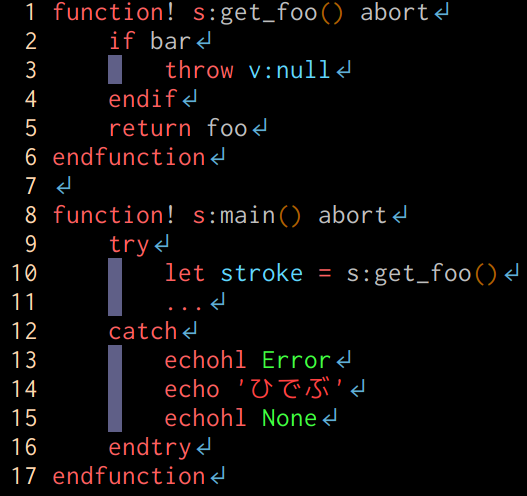
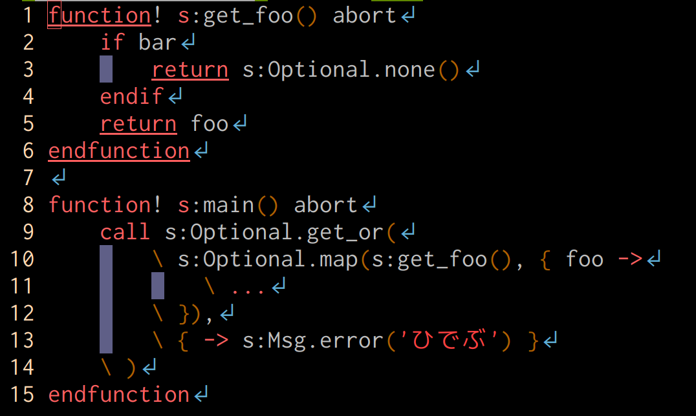

## 僕の推し
## Vimプラグインを見て！
　
#### .vimconf.swp.2018 🤟🙄🤟 aiya000
### https://aiya000.github.io/Maid/vimconf.swp.2018

- - - - -

## 僕


- 推しVim: **NeoVim**
- 名前: aiya000 (あいや)
- Twitter: [pubilc\_ai000ya](https://twitter.com/public_ai000ya)
- GitHub: [aiya000](https://github.com/aiya000)

- - - - -

# Chiel92/vim-autoformat
# LeafCage/foldCC
# aiya000/aho-bakaup.vim

- - - - -

# aiya000/vim-fmap

- - - - -

### aiya000/vim-fmap

nnoremapとかvnoremapとかみたいに  
fキーにマッピングをかけるやつ

```vim
FNoreMap tt ・
FNoreMap p （
FNoreMap k 「
FNoreMap K 『
```

`df｛IME切り替え｝,｛IME切り替え｝`  
とか押したくなかったので作った :point_right:

- - - - -


- - - - -

### aiya000/vim-fmap

例えば`[f'su`とかすると「す」のところに、  
IME切り替えなしでf移動できる！！

日本語ドキュメント作成や  
日本語本の執筆に便利🙄

- - - - -

# andymass/vim-matchup
# cohama/lexima.vim
# deris/vim-shot-f
# lambdalisue/gina.vim
# lambdalisue/vim-manpager
# lambdalisue/vim-pager

- - - - -

# 閑話休題

- - - - -

## 皆さん普段
## Vim scriptをどんな感じに
## 書いてますか？

- - - - -

## Procedural?



- - - - -

## Functional?



- - - - -

## vital.vimが貴方の
## Functional Programmingを
## :tada: サポートします :tada:

- - - - -

### Data.Optional

- - - - -

### Data.Either

- - - - -

### Data.List

- - - - -

# 本題再開🙄

- - - - -

# machakann/vim-highlightedyank
# nathanaelkane/vim-indent-guides
# rbtnn/vimconsole.vim
# rhysd/vim-operator-surround
# ryanoasis/vim-devicons
# thinca/vim-textobj-between
