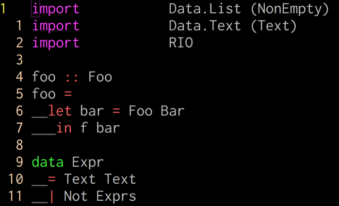

## 僕の推し
## Vimプラグインを見て！
　
#### .vimconf.swp.2018 🤟🙄🤟 aiya000
### https://aiya000.github.io/Maid/vimconf.swp.2018

<!-- TODO
- 最後に「終わり」みたいな一言ページを入れる
- 編の区切りになにか「ここまでで半分」「あともう少し」「最後」とか入れる
-->

- - - - -

## 僕


- 推しVim: **NeoVim**
- 名前: aiya000 (あいや)
- Twitter: [pubilc\_ai000ya](https://twitter.com/public_ai000ya)
- GitHub: [aiya000](https://github.com/aiya000)

- - - - -

# 今日の内容

- - - - -

### 今日の内容

Vimプラグインの紹介

<aside class="notes">
僕がお世話になっているVimプラグインの紹介。
</aside>

- - - - -

### 今日の内容

- 見た目編
- 編集編
- ツール編
- 自作プラグイン

<aside class="notes">
## 見た目系  
Vimの見た目を格好良く、
または通常見えないものを可視化するようなプラグインについて。  
　  
## 編集編  
Vimの操作を拡張するようなプラグイン。  
Vimmerの皆さんが一番大好きそう。  
　  
## ツール編  
例えばVim上でgit操作をできるようにするなど……
従来できなかった、やりにくかったことを容易にできるようにするもの。  
　  
## 自作プラグイン  
なぜ作ったのか、
どこらへんに拘ったのかなど。
</aside>

- - - - -

# 見た目編

<aside class="notes">
ここから本編。  
まずは見た目についてのプラグイン。
</aside>

- - - - -

# LeafCage/foldCC

- - - - -

### LeafCage/foldCC

Vimの**畳み込み**をしたときの  
表示をわかりやすくしてくれる

```
# 畳み込みとは🙄
{{{
　ここらへんがサマリー1行で
表示される機能（マーカー折りたたみ）。
　その他region設定済みの言語では
メソッドをサマリー1行で表示したり……などなど、
色んな方法で折りたたみできる！
}}}
```

<aside class="notes">
もしかしたら知らない方もいるかもしれないですが、
Vimには畳み込みという機能が付いていて……  

こんな感じ（ここで次へ） ->
</aside>

- - - - -

### LeafCage/foldCC

<p class="left">
before :point_down:
</p>


<p class="right">
:point_up: after
</p>

<aside class="notes">
従来の表示が左、
foldCCでの表示が右。  
見ての通り素晴らしい。  
　  
例えばScalaやC#などの構文でメソッドごとの折りたたみを設定すると、  
見やすすぎて「「最強」」になる。  
　  
Vim初心者にこそ使ってみて欲しい。
</aside>

- - - - -

# andymass/
# vim-matchup

- - - - -

### andymass/vim-matchup

matchpair（括弧の対応付け）を  
**括弧やワードの対応付け**に  
拡張してくれる。

```vim
function s:f() abort
" ↑
" 例えば 'function' の上にカーソルを置いて
" % キーを押すと 'endfunction' の上に瞬間移動できる
" ↓
endfunction
```

- - - - -

### andymass/vim-matchup


- - - - -

# deris/vim-shot-f

- - - - -

### deris/vim-shot-f


- - - - -

# machakann/
# vim-highlightedyank

- - - - -

### machakann/vim-highlightedyank

yankした箇所が「チカッ」って光る。


<aside class="notes">
シンプルだけどすっごい便利で、
これを導入してから
「んっ、今ちゃんとヤンクできた？？」
ってなることがめっちゃ減った。
</aside>

- - - - -

# nathanaelkane/
# vim-indent-guides

- - - - -

### nathanaelkane/vim-indent-guides

:point_down: :point_down: :point_down:


<aside class="notes">
これ！
（多分このプラグインはこの画像を見れば伝わるので、
これくらいの説明で次いっていいと思う）
</aside>

- - - - -

### nathanaelkane/vim-indent-guides

インデントを可視化してくれる。  
トグルで有効/無効を切り替えられる。

<p class="minimumize">

</p>

<aside class="notes">
スペースでインデントを取る派には必須。  
僕はもうこれ無しではテンション上がらなくて
コーディングできないくらい。
</aside>
- - - - -

# ryanoasis/
# vim-devicons

- - - - -

### ryanoasis/vim-devicons

対応プラグインにアイコンを表示してくれる。


:point_up: `:Denite file_mru` の例

<aside class="notes">
またテンション上げる系ですね。  
Vimはエディタなので格好いい必要があります。  
その他NERDTree, airline, powerline, vimfiler
などなどに対応しています。
</aside>

- - - - -

# 編集編

- - - - -

# cohama/lexima.vim

- - - - -

### cohama/lexima.vim

対応する文字を自動入力してくれる。

<aside class="notes">
（このページは軽く飛ばす） ->
</aside>

- - - - -

### cohama/lexima.vim

`(`, `{`, `"`に対して`)`, `}`, `"`など。


<aside class="notes">
例えば括弧開きに対して括弧閉じ、  
波括弧開きにも波括弧閉じ、  
ダブルクオーテーションに対しては  
もう一つダブルクオーテーションを……
といった感じ。  
これがどう便利かというと……
->
</aside>

- - - - -

### cohama/lexima.vim

＞＞＞ 🤟🙄🤟 ＜＜＜  
＞＞＞ テンション上がる ＜＜＜

<aside class="notes">
テンションが上がります。  
これ大事ですね。
あと指が楽になる。
</aside>

- - - - -

# rhysd/vim-
# operator-surround

- - - - -

### rhysd/vim-operator-surround :dog2:

「選択している範囲の囲み文字を**付加**」  
（選択している範囲の囲み文字を**削除**）  
＜選択している範囲の囲み文字を**変更**＞

<aside class="notes">
あとは選択している範囲の囲み文字を
「別のものに」変更する。
どんな感じかっていうと……
->
</aside>

- - - - -

### rhysd/vim-operator-surround :dog2:


<aside class="notes">
`Sap`で半角括弧を付加。  
範囲選択をした後に`Sd`で、
各囲みを削除。  
範囲選択をした後に`Csjk`で、
全角括弧から全角角括弧に変更。
</aside>

- - - - -

### rhysd/vim-operator-surround :dog2:

Java, Kotlin, C#, Scala等々の  
**色んな種類の括弧が登場**する言語に  
特におすすめ。

<aside class="notes">
もちろん慣れると、
Haskellだとかそういう言語でも多用するようになります。
便利。
</aside>

- - - - -

# thinca/vim-
# textobj-between

- - - - -

### thinca/vim-textobj-between :fish:

\***ある文字とある文字の間**\*  
\_を指定（選択）できる\_。

- - - - -

### thinca/vim-textobj-between :fish:


- - - - -

### thinca/vim-textobj-between :fish:

textobjなので  
**全てのキーマッピングの力**が**倍増**する。

！！！！！  
:bomb: :smiling_imp: :bomb:  
！！！！！

- - - - -

# Chiel92/
# vim-autoformat

- - - - -

### Chiel92/vim-autoformat

ファイル保存時に  
コードを自動で**整形**して保存してくれる。

<aside class="notes">
コードフォーマッターとVimを連携させてくれるプラグインです。  
（ここで次へ） ->
</aside>

- - - - -

### Chiel92/vim-autoformat

(with elm-format)  
**before**


<aside class="notes">
こういうコードがあったときに、
ファイルを保存すると……  
（ここで次へ） ->
</aside>

- - - - -

### Chiel92/vim-autoformat

(with elm-format)  
**after**



<aside class="notes">
勝手に整形して保存してくれます！
</aside>

- - - - -

### Chiel92/vim-autoformat

**コードフォーマット**に  
気を使いたくない人の必需品。

<p class="minimumize">


</p>

<aside class="notes">
例えば最高にテキトーで
最悪なコーディングスタイルを書き荒らしたとしても、
保存すると綺麗なコードが返ってくる。
</aside>

- - - - -

# ツール編

<aside class="notes">
まさにVimを拡張するようなプラグインです。
</aside>

- - - - -

# lambdalisue/
# gina.vim

- - - - -

### lambdalisue/gina.vim

gitコマンドをVim上で実行して、  
いい感じの表示とキーマッピングを  
提供してくれる。

`:Gina log`
`:Gina status`
`:Gina commit`

- - - - -

### lambdalisue/gina.vim

`:Gina log`


<aside class="notes">
…  
（説明した後にこれを言う）  
…  
こうやって
「だんだんだるくなってコミットメッセージがテキトーになっていってる」
のもよくわかる！
</aside>

- - - - -

### lambdalisue/gina.vim

`:Gina status`


<aside class="notes">
ここで `<<` キーや `>>` キーを押すと、
`git-add`ができる。  
…  
（説明した後にこれ言う）  
…  
ここで `:Gina commit` または
キーマッピングの `cc` キーを押すと、
`git-commit` がVim上で呼び出される。
</aside>

- - - - -

### lambdalisue/gina.vim

`:Gina commit`


<aside class="notes">
この「Emojis」っていうのは`git config commit.template`
で設定できるものなんですが、
もちろんそれを読み込んでくれます。
</aside>

- - - - -

### lambdalisue/gina.vim

GUIのgitクライアントいらず！？💪🤔

<p class="minimumize">
  


</p>

<aside class="notes">
僕は
「一発で済みそうなgitコマンド」
をGinaに任せて、
操作が長くなりそうなら
`:terminal`に任せてます。  
個人的にはGUIのgitクライアント使わなくても、
これで満足。
</aside>

- - - - -

## lambdalisue/vim-manpager

- - - - -

### lambdalisue/vim-manpager :sunglasses:

manコマンドをVimで**開く**&**表示**する。

- - - - -

### lambdalisue/vim-manpager :sunglasses:

`:Man vim`

`$ MANPAGER='vim -c MANPAGER -' man vim`


<aside class="notes">
これのイケメンなところは、ちゃんと
</aside>

- - - - -

# rbtnn/
# vimconsole.vim

- - - - -

### rbtnn/vimconsole.vim :rabbit2:

Vim script向けImmediate Window


<aside class="notes">
Vim scriptに埋め込んだ:VimConsoleLogコマンドとその引数の文字列を、
Immediate Windowに表示。  
皆さん.vimrcをいじる機会は多いかもしれませんので、
.vimrcのデバッグにどうぞ。
</aside>

- - - - -

# 自作Vimプラグイン

<aside class="notes">
最後に自作Vimプラグインを紹介させてください。
</aside>

- - - - -

# aiya000/
# aho-bakaup.vim

- - - - -

### aiya000/aho-bakaup.vim

ファイル保存時に  
その**バックアップ**として  
別の場所にも保存しておいてくれる。

- - - - -

### aiya000/aho-bakaup.vim

<p class="left">
日別 :point_down:
</p>


<p class="right">
:point_up: 分別
</p>

<aside class="notes">
こんな感じに保管してくれる。
</aside>

- - - - -

### aiya000/aho-bakaup.vim

まだgit-commitしてないファイルを  
**ふっ飛ばしちゃうアレ**に有効。

```shell-session
$ git status
 M foo.md
 M bar.css
$ git reset --hard HEAD  # 手が勝手に打つ
< foo.mdとbar.cssへの変更が吹っ飛ぶ >

< 数秒後に意識が戻って後の祭り >
```

<aside class="notes">
僕も何度もお世話になった。  
あの絶望を回避したい人は是非に。
</aside>

- - - - -

# aiya000/vim-fmap

- - - - -

### aiya000/vim-fmap

nnoremapとかvnoremapとかみたいに  
fキーにマッピングをかけるやつ

```vim
FNoreMap tt ・
FNoreMap p （
FNoreMap k 「
FNoreMap K 『
```

<aside class="notes">
`df｛IME切り替え｝,｛IME切り替え｝`  
みたいに、  
横移動だけのためにキーを  
いっぱい押すのはめんどかったので  
作った。  
こんな感じ（ここで次へ） ->
</aside>

- - - - -


- - - - -

### aiya000/vim-fmap

`[f'su`とかすると「す」のところに  
IME切り替えなしでf移動できる🙄

<aside class="notes">
日本語ドキュメント作成や  
日本語本の執筆に便利。
</aside>

