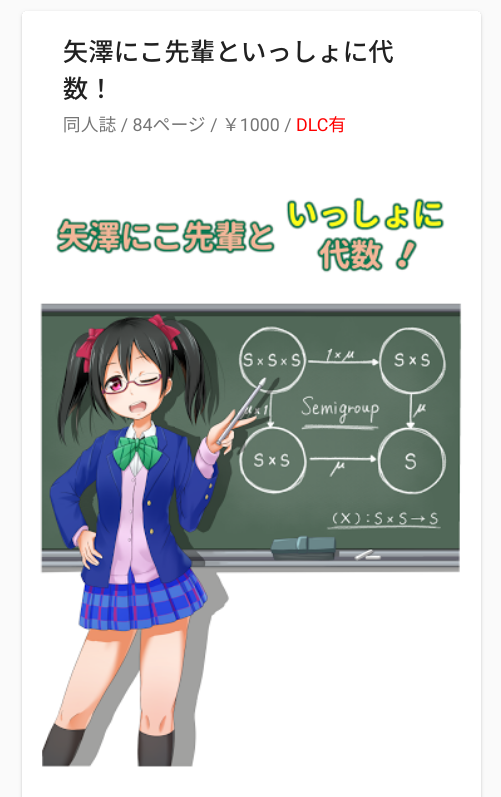
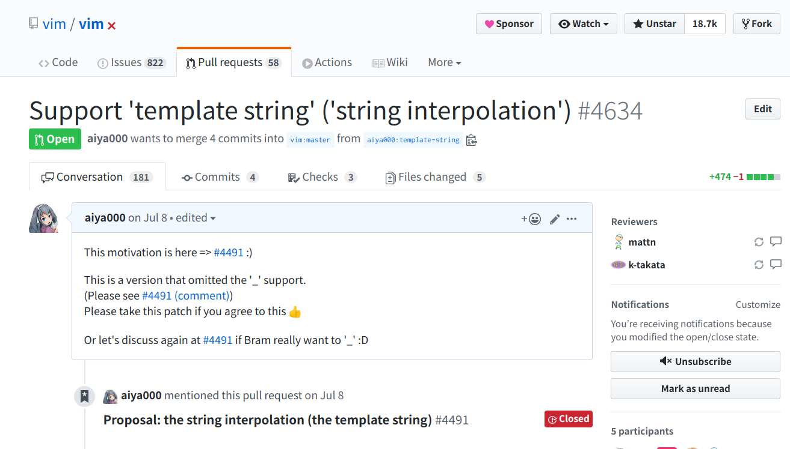

## aiya000ってだれ？
## 🤟🙄🤟

- - - - -

### aiya000ってだれ？

    

        
    

    

        <ul>
            <li>
                名前
                <ul>
                    <li>**aiya000**</li>
                    <li>**あいや**</li>
                    <li>public_ai000ya</li>
                </ul>
            </li>
            <li>
                推し
                <ul>
                    <li>Haskell</li>
                    <li>Vim</li>
                    <li>Arch Linux</li>
                </ul>
            </li>
        </ul>
    

- - - - -

## やった/やってる こと

- - - - -

### やった/やってる こと

- **圏論**および**数学**への入門書を書いた
- **代数**（的構造）学の本を書いた
- **Vim**へコントリビュートしてる
- **Haskell**で自作言語を開発してる

<ul class="small">
    <li>
        その他
        <ul class="small">
            <li>NativeScript-Vueでモバイルアプリを開発してる</li>
            <li>Vue.jsでWebサイト開発してる</li>
        </ul>
    </li>
</ul>

- - - - -

    
    

- - - - -

- - - - -

- - - - -

## 最近 登壇・発表・出展 したもの

- - - - -

### 最近 登壇・発表・出展 したもの

- [Haskell Day 2019 - 30分登壇](https://aiya000.github.io/posts/2019-12-04-haskellday2019.html)
- [VimConf 2019 - スタッフ & LT 5分](https://aiya000.github.io/posts/2019-12-02-vimconf2019.html)
    - 
[VimConf 2019 LT](https://www.youtube.com/watch?v=rDe1q-USCMI&list=PLx8bw5NQypskQlEGupVqoUBBJtRmNXLet&index=14)<a>（17:00から）</a>

- - - - -

# よろしく！
