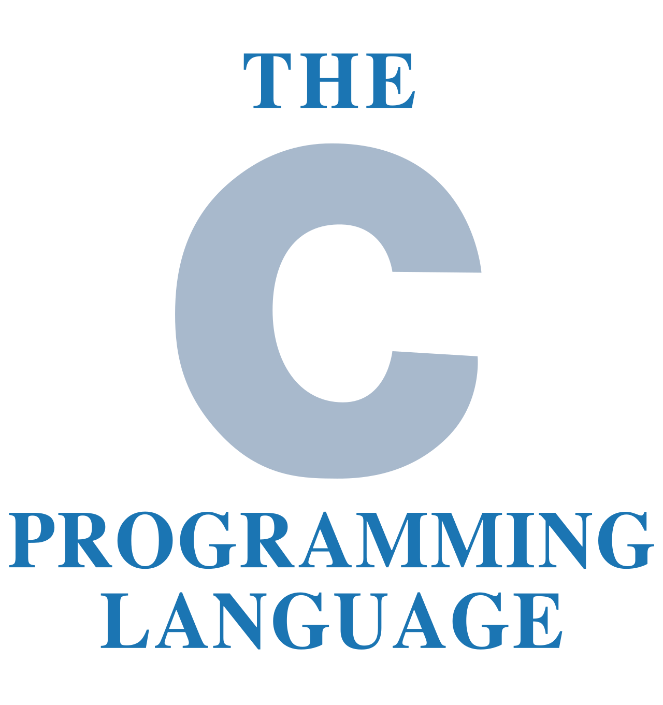
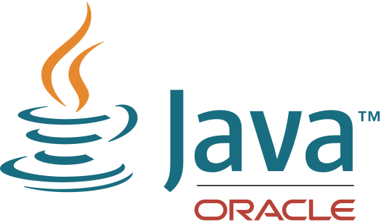
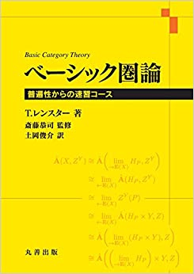
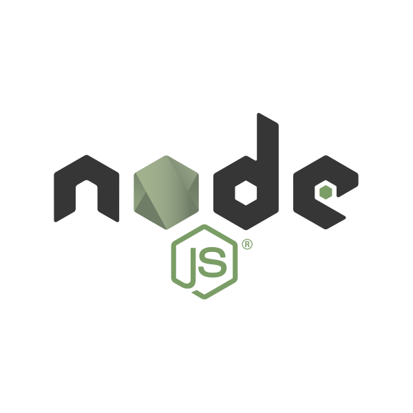
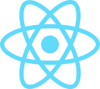
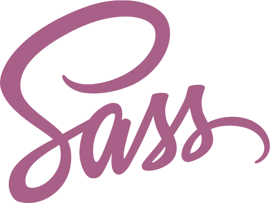
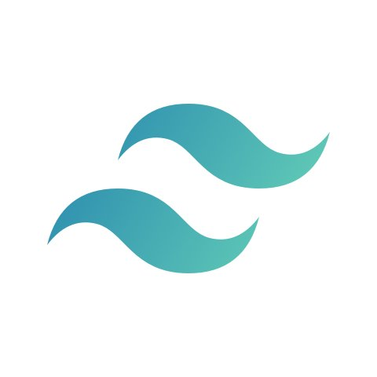
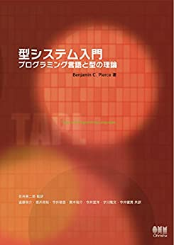

## 自己紹介
# aiya000 / あいや
### 2023年
#### [https://bit.ly/3xarJnR](https://aiya000.github.io/Maid/who-is-aiya000-2023)

- - - - -

# 概要

- - - - -

#### 概要

- ✨ Vim ✨
    - 人生の相棒
- ✨ Haskell ✨
    - モナド, **圏論**, **代数的構造**
    - パーサー(コンビネーター|ジェネレーター)

- - - - -

#### 概要

- ✨ **TypeScript** ✨
    - [unsafe](https://qiita.com/kgtkr/items/1c136e1e4ccee8928bc8)警察👮🚓==3
    - Vue.js, Nuxt.js, React.js, Next.js, Gatsby.js
    - TaPL ﾁｮｯﾄ ﾖﾝﾀﾞ ※

※ 静的型付き言語を作る本。真の型健全性を学べる。6,732円する。

- - - - -

型警察👮🚓==3

- - - - -

### 圏論

本書いたよ！

↑クリックして！ いいねしてね！ 買ってね！

- - - - -

### 代数的構造

こっちも本書いたよ！

↑クリックして！ いいねしてね！ 買ってね！

- - - - -

# 好きなこと

- - - - -

#### 好きなこと

- **技術の最新動向**を追うこと
    - ほぼ毎日、メディアで追ってます

- **知らない技術**に触れること
    - 「は？ こんなこともできないの？  
      　　　　　　　　ダメじゃん。すき」
    - とか言ってる

- - - - -

#### 好きなこと

- 数学
    - なんもわからん

- 外部勉強会での発表
    - VimConf
    - Haskell Day

- - - - -

- - - - -

# 職業

- - - - -

#### 職業

- **フロントエンドエンジニア（現）**
- フルスタックエンジニア（旧）

- - - - -

and a lot...

- - - - -

# 職歴

- - - - -

#### 職歴

[色々やった](https://github.com/aiya000/Curriculum-Vitae/blob/master/README.md#%E8%81%B7%E5%8B%99%E7%B5%8C%E6%AD%B4)  
（色々やった）

- - - - -

# 今後

- - - - -

