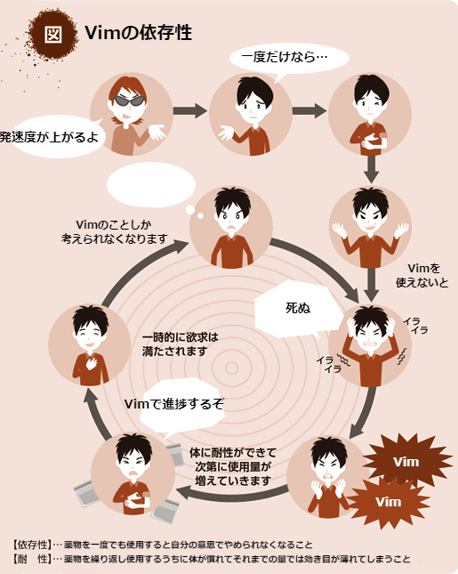
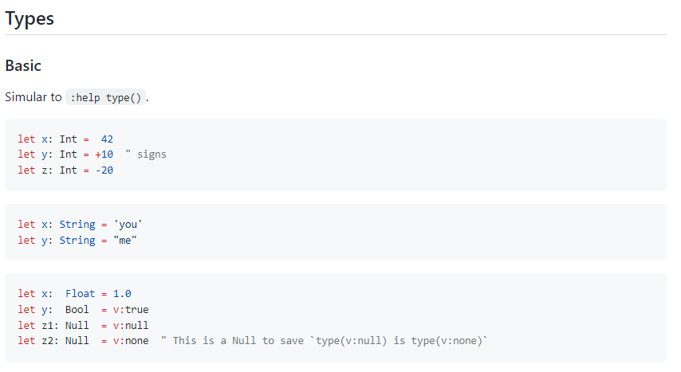
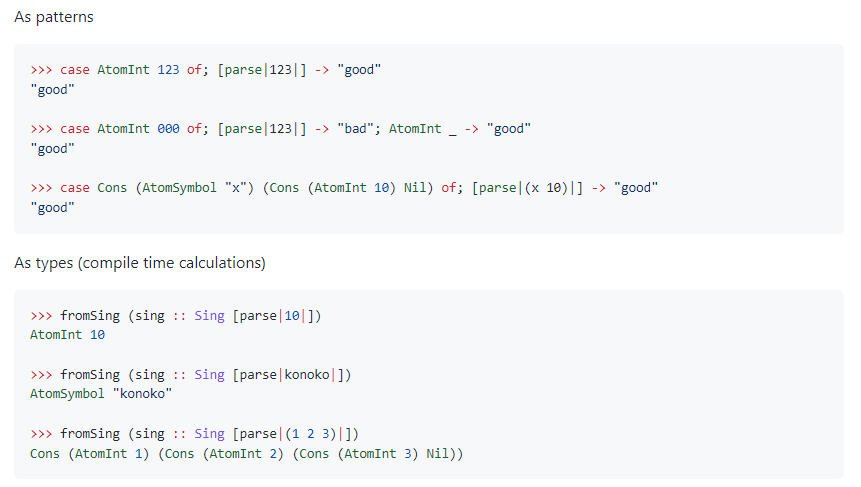
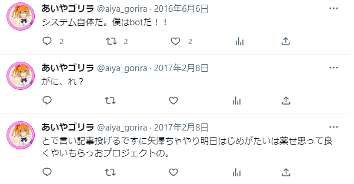
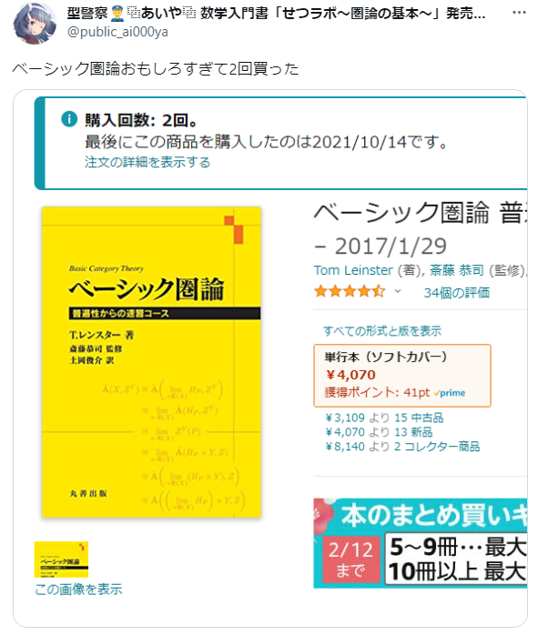

## 自己紹介
# aiya000 / あいや
### 2023年
#### [https://bit.ly/3xarJnR](https://aiya000.github.io/Maid/who-is-aiya000-2023)

<aside class="notes">
どうもこんにちは。
あいやと申します。  
これから自己紹介LTをしていきます。
よろしくお願いします！
</aside>

- - - - -

# プロフィール

<aside class="notes">
まずは簡単なプロフィールから。
</aside>

- - - - -

#### プロフィール

- 名前: aiya000 (あいや)
- Twitter: [@pubilc\_ai000ya](https://twitter.com/public_ai000ya)
- mstdn.jp: [@aiya000](https://mstdn.jp/web/@aiya000)
- GitHub: [aiya000](https://github.com/aiya000)

<aside class="notes">
名前は正確には、あいやゼロゼロゼロと申します。
このアイコンで活動をしています。
TwitterやMastodon・GitHubなどをやってます。
</aside>

- - - - -

# 技術

<aside class="notes">
僕の主な技術スタックを紹介します。
</aside>

- - - - -

#### 技術

- ✨ Vim ✨
    - マウスなしでの直観的編集！ プラグインの豊富さ！  
      矩形編集！！

- ✨ Haskell ✨
    - モナド！！ **圏論**, **代数的構造**
    - Higher Kind Types （型のすごいやつ）
    - lens （状態管理のすごいやつ）, etc
    - パーサー(コンビネーター|ジェネレーター)（構文解析するやつ）

<aside class="notes">
使っているエディタはVimです！
ここは大切なところなので、宣言します。
   
一番得意な言語はHaskellです。
Haskellで、強い静的型付けのなんたるや、を学びました。
HaskellにはKindっていう、型に対する型みたいなのがあったりして、楽しいです。 
構文解析して、自作プログラミング言語を作ったりしてました。
</aside>

- - - - -

#### 技術

- ✨ 数学 ✨
    - 抽象化は神！ プログラミングへの応用！  
      たのしい！！

<aside class="notes">
数学もちょっとやってます。
アルゴリズムの幅が増えて、とても気持ちがいいです。
</aside>

- - - - -

Vim

<aside class="notes">
Vimについて。
</aside>

- - - - -

#### 技術 - Vim

✨ Vim ✨

- Vim歴11年
- プラグインを作ったりしてる
- Vimがないと進捗速度が `1/10` くらいに  
  落ちると思う

<aside class="notes">
Vim歴は11年です。
高校生の頃から使っています。  
プラグインも作ってます。  
Vimがないと生きていけないので、よろしくお願いします。
</aside>

- - - - -

#### 技術 - Vim

[neosnippet-emoji](https://github.com/aiya000/neosnippet-emoji)

補完候補にEmojiを追加するプラグイン。

<aside class="notes">
いくつか僕が作ったVimプラグインを紹介させてください。
よかったらStarもください。  
はい。  
VimでEmojiを使うときに便利です。
neosnippet.vimっていう大手プラグインに依存してます。
</aside>

- - - - -

#### 技術 - Vim

[vim-webpage](https://github.com/aiya000/vim-webpage)

Vimで選択した単語の翻訳ページ（Webページ）を  
ポップアップで開いたりするプラグイン。

<aside class="notes">
VimのポップアップでWebページを開くやつです。
英単語を引くときに主に使ってますが、
選択してる文字をよしなにURLパラメーターにしてページを開くだけなので、
Google検索などでも色々使えたりします。
</aside>

- - - - -

#### 技術 - Vim

[aho-bakaup.vim](https://github.com/aiya000/aho-bakaup.vim)

ファイル保存時に、所定の場所にバックアップを作成するプラグイン。

<aside class="notes">
これはgit管理で溢れてしまったときの予防策です。
愛用しています。
</aside>

- - - - -

#### 技術 - Vim

[vim-ghcid-quickfix](https://github.com/aiya000/vim-ghcid-quickfix)

HaskellのビルドやテストをQuickFixで見る  
プラグイン。

<aside class="notes">
これはHaskellの開発で使うやつですね。
QuickFixっていう、Vimのメッセージリストみたいなものに、ビルド結果を流します。
いろいろよしなにやってくれます。
</aside>

- - - - -

Vim

<aside class="notes">
Vimです。
やばいですね！
</aside>

- - - - -

Haskell

<aside class="notes">
次にHaskellです。
多くは語りませんが、
Haskellには人生を救われた経験があります。
</aside>

- - - - -

#### 技術 - Haskell

[Time script](https://github.com/aiya000/hs-time-script)
（自作言語）
（未完成）

<aside class="notes">
Haskellで作っていた、自作プログラミング言語です。
Vimに内臓されたVim scriptという言語の置き換えを狙っていました。
作っていたらVim script自体に静的型付けが導入されたり、
TypeScriptが使えるようになったりしたので、
お蔵入りになりました。  
成仏してください。  
でも構文解析と自動化テストの練習にかなりなったので、
成果はあったと思います。
</aside>

- - - - -

#### 技術 - Haskell

[((((zuramaru))))](https://github.com/aiya000/hs-zuramaru)
Lisp方言

<aside class="notes">
これも自作プログラミング言語で、
Lisp方言です。  
これはHaskellとの親和性がいつの間にか高くなったやつで、
型でLispが書けたりします。
ちゃんとコンパイル時に型で書いたLispが処理されて、結果が実際の型に落とし込まれます。
気になったらリポジトリのreadmeを見てみてください。  
もちろん普通にHaskellの実行時にも、Lispの実行ができます。
</aside>

- - - - -

#### 技術 - Haskell

[ゴリラ](https://github.com/aiya000/hs-gorira)

<aside class="notes">
これはゴリラです。
Twitter botです。
僕の発言をソースに、意味の分からないことを話すbotです。  
マルコフ連鎖の連結が弱くて、こんなことをしゃべってます。
</aside>

- - - - -

数学

<aside class="notes">
一度Vimから離れて、数学です。
数学もちょっとだけ趣味でかじっています。
</aside>

- - - - -

#### 技術 - 数学

✨ 数学 ✨

<ul style="margin: 32px">
    <li>ちょっとだけわかる</li>
    <li>圏論
        <ul>
            <li class="sub">圏論の基礎   ちょっと読んだ</li>
            <li class="sub">ベーシック圏論   ちょっと読んだ</li>
        </ul>
    </li>
    <li>代数的構造（ちょっと）</li>
</ul>

<aside class="notes">
主に圏論っていう、数学を抽象化する分野が好きで、ぼーっと眺めています。  
代数的構造っていう、足し算みたいな、皆さんがいつも使っているものを抽象化する分野もちょっとだけかじりました。
ちょっとだけです。  
最近は、毎日圏論ばっかりやってます。
色んな発見がいっぱいあるので、やってて楽しいです。
</aside>

- - - - -

TypeScript

<aside class="notes">
みんな大好きTypeScriptも、主力言語として使っています。
</aside>

- - - - -

#### 技術 - TypeScript

✨ **TypeScript** ✨

- コードの治安を守る仕事をしている
    - [unsafe](https://qiita.com/kgtkr/items/1c136e1e4ccee8928bc8)警察👮🚓==3
- Vue.js, Nuxt.js, React.js, Next.js, Gatsby.js
- TaPL ﾁｮｯﾄ ﾖﾝﾀﾞ ※

※ 静的型付き言語を作る本。真の型健全性を学べる。6,732円する。

<aside class="notes">
TypeScriptは放っておくと静的型付けが壊れる言語なので、
数学で学んだことや、TaPLというつよつよの本で学んだ知識を用いて、
不安全なことをレビューで指摘したりしています。
</aside>

- - - - -

型警察👮🚓==3

<aside class="notes">
なのでチーム内では型警察って呼ばれています。
今後も型警察としてがんばっていこうと思います。
</aside>

- - - - -

その他

<aside class="notes">
その他です。
</aside>

- - - - -

and a lot...

<aside class="notes">
その他技術スタックを語ると果てしないので、ここらでとどめておきます。
一応参考程度に、これらを使ったことがあります。  
Androidアプリとか、ClojureっていうLispとか、Scalaとか。
TailwindCSSとか、vanilla-extractとか、Next.jsとか。
あとはFirebaseとか。
</aside>

- - - - -

#### 技術 - 圏論

本書いたよ！

↑クリックして！ いいねしてね！ 買ってね！

<aside class="notes">
あとは数学の本を自費出版で書いたりしてます。
売り上げは600部を超えました。
ありがとうございます！  
これは数学未入門者に、数学を説明して、圏論に入ってもらう、ゆるふわな数学を目指した本です。
Haskellや集合論の基礎も書いてます。
よかったらいいねしたり、買ったりしてください。
</aside>

- - - - -

#### 技術 - 代数的構造

こっちも本書いたよ！

↑クリックして！ いいねしてね！ 買ってね！

<aside class="notes">
こちらは某スクールアイドルの同人誌です。
こっちは数学に既に入門した人向けで、先ほど紹介した代数的構造を、Haskellを用いて説明していく本です。  
こっちもよかったら、いいねしたり、買ったりしてくれるとうれしいです！
</aside>

- - - - -

#### 技術 - 執筆その他

↓PDFが無料らしいよ！

- [簡約!? λカ娘 10](https://ikmsm.pastillage-research.org/ikmsm/books/c92.html)
- [簡約!? λカ娘 11](https://ikmsm.pastillage-research.org/ikmsm/books/c94.html)

<aside class="notes">
ラムダカ娘っていう合同本にも数学記事を寄稿しました。
これはPDFがいつの間にか無料になっていたので、
興味ある人は、
ぜひこのリンクからダウンロードしてみてください。
</aside>

- - - - -

# 職歴

<aside class="notes">
次は簡単な職歴について話します。
皆さんと違って、ビッグネームなものは全然ないのですが……。
</aside>

- - - - -

#### 職歴

- **フロントエンドエンジニア（現）**
- フルスタックエンジニア（旧）

<aside class="notes">
現職はフロントエンドエンジニアとして働いています。
主に制御周りを担当しています。
デザインは周りの方々に担当していただいて、制御周りのスペシャリストとして生計をたてています。
デザイン班のみなさん、デザイン周り、いつもありがとうございます！
</aside>

- - - - -

#### 職歴

[色々やった](https://github.com/aiya000/Curriculum-Vitae/blob/master/README.md#%E8%81%B7%E5%8B%99%E7%B5%8C%E6%AD%B4)  

<aside class="notes">
細かい職歴がいっぱいなので、全体はこのリンクに載せています。
細かいものがいっぱいなので、今回の発表ではちょっとだけ紹介します。
</aside>

- - - - -

#### 職歴 - 新卒

- 高校生の研修を引率、Androidアプリを開発

- 工事現場のマネジメントアプリを  
  受託チームで開発（Windowsアプリ）
    - **受注元におもむいて**、受注元に置いてある  
      オンプレミスサーバーに納品！

<aside class="notes">
まず学校を卒業して、初めてついた業務が、高校生たちの指導でした。
プログラミング未経験だったり、
少しわかるくらいの高校生たちにいきなり実装をやってもらうのは無理なので、
うまいことマネジメントしてGetting Kotonakiしました。  
あとは時代なのですが、工事用のWindowsアプリをWinFormsっていうフレームワークで作りました。
受注するときは受注先におもむいて、むこうに置いてあるサーバーに直接納品していました。
時代ですね。  
もうこんなナンセンスはいらんので、
皆さんはデプロイできる環境を作りましょう。
</aside>

- - - - -

#### 職歴 - 新卒

- 5周年セレモニーのエンディング映像を  
  Webアプリで作成

<aside class="notes">
あとはこういう大事なことも、任されました。
これら全部、なぜか僕一人に任されるので、あんまり学べる環境じゃなかったです。  
今は学べる環境にいられて、幸せです。
</aside>

- - - - -

#### 職歴

- 変なホテルのロボット開発のお手伝い
- 某大手企業さんの音声加工技術のお手伝い
- 某大手企業さんのための、GitHubのマネジメントアプリ作成
- iOSアプリなんもわからん！
    - なのにリファクタリング任された

<aside class="notes">
あとはこんなこともしました。
</aside>

- - - - -

# 好きなこと

<aside class="notes">
後味がわるいので、最後に好きなことを紹介します。
</aside>

- - - - -

#### 好きなこと

- **技術の最新動向**を追うこと
    - ほぼ毎日、メディアで追ってます

- **知らない技術**に触れること
    - 「は？ こんなこともできないの？  
      　　　　　　　　ダメじゃん。すき」
    - とか言ってる

<aside class="notes">
技術情報は毎日追っています。
フロントエンド界隈は発展が日々すさまじいので、
無限に情報が得られるという点で、
すごく合っていると思います。
</aside>

- - - - -

#### 好きなこと

- 数学

- Vim

- 外部勉強会での発表
    - VimConf
    - Haskell Day

<aside class="notes">
先ほど説明した通り、数学とVimが好きなのですが、外部勉強会での発表も好きです。
</aside>

- - - - -

<aside class="notes">
VimConfとHaskell Dayでよく発表してます。
</aside>

- - - - -

# 今後

<aside class="notes">
今後ですが
</aside>

- - - - -

#### 今後

- 本を商業出版したい！

- 圏論完全に理解したい！

- TaPL・圏論の基礎・ベーシック圏論を  
  全部読みたい！

<aside class="notes">
本を商業出版したいと思っています！
コネがある人いたら、ください。  
圏論ももっと理解していきたいです。  
TaPLとか圏論の基礎やベーシック圏論などの、難しいまだ読み切れていない本も、読み切ってドヤ顔したいです。
</aside>

- - - - -

ありがとうございました 👋

<aside class="notes">
以上で発表を終わります。
ご清聴ありがとうございました。
</aside>
