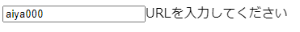

# zodはどんなときに使えるのか

- 2023-06-13
- [aiya000](https://twitter.com/public_ai000ya)

<a style="position: absolute; bottom: 0; left: 0; width: 150px; height: auto;" href="https://aiya000.github.io/Maid/zod%E3%81%AF%E3%81%A9%E3%82%93%E3%81%AA%E3%81%A8%E3%81%8D%E3%81%AB%E4%BD%BF%E3%81%88%E3%82%8B%E3%81%AE%E3%81%8B/#/">

</a>

<aside class="notes">
aiya000と申します。 <br />
本日は「zodはどんなときに使えるのか」という発表をさせていただきます。 <br />
よろしくお願いします。 <br />
<br />
このLTでは最後にコードが出てくるので、このQRコードを読んでもらって、手元で見ながら聞いていただくと、いいと思います。
ちょっと20秒、QRコードを読む時間を取ります。
（20秒後）
ということで、発表を始めさせていただきます。
</aside>

- - - - -

## zodはどんなときに使えるのか

<aside class="notes">
「zodはどんなときに使えるのか」それは
</aside>

- - - - -

## TypeScriptを書くとき
## ぜんぶ

<aside class="notes">
ぜんぶです。
</aside>

- - - - -

# ＿人人人人人＿
# ＞　ぜんぶ　＜
# ￣Y^Y^Y^Y^Y^￣

<aside class="notes">
ぜんぶ！
</aside>

- - - - -

## 僕


- 名前
    - aiya000
- Twitter
    - [pubilc\_ai000ya](https://twitter.com/public_ai000ya)

- すき
    - 静的型付き言語
        - **TypeScript**・Haskell・Scala3・Idris
    - 数学
        - 圏論・代数的構造・操作的意味論

<aside class="notes">
というところで、自己紹介をはさませていただきます。 <br />
僕はaiya000と申します。あいやって呼ばれてます。 <br />
HIKKY株式会社というところで働いています。 <br />
いましゃべっているんですが、地声が裏声です。
チャームポイントとして思ってもらえればと思います！
<br />
Twitterやってます。よかったらフォローお願いします。 <br />
静的型付き言語がだいすきです。 <br />
TypeScriptはもちろん、Haskellとかもやってます。 <br />
 <br />
数学もちょっとかじってます。 <br />
最近よく名前が出てくる圏論や・代数的構造っていう分野もちょっとだけやってます。 <br />
この2つについては本を出していて
</aside>

- - - - -

## 僕

こういう数学の本を書いてます。

<div>
    <a href="https://aiya000.booth.pm/items/1298622"></a>
    <a href="https://aiya000.booth.pm/items/1298622"></a>
</div>

<aside class="notes">
せつラボっていう本を出しています。 <br />
数学がわからないけど、入門したい！ という人向けに、やさしい内容の本になっています。 <br />
このLTのこの画像をクリックすると販売ページに進めるので、よかったら買ってくれると、僕がよろこびます！ <br />
</aside>

- - - - -

## 僕

こういう数学の本を書いてます。

[](https://aiya000.booth.pm/items/1040121)

<aside class="notes">
代数的構造についても本を出しています。 <br />
こちらはちょっとだけ数学に慣れた人向けの本で、せつラボを読んだあとなら、難易度的にちょうどいいかもしれないですね。 <br />
こちらもぜひ、よろしくお願いします！ <br />
</aside>

- - - - -

<a style="position: absolute; bottom: 0; right: 0; width: 150px; height: auto;" href="https://zenn.dev/aiya000/articles/cd06a0f3620d59">

</a>

[今日のLT資料](https://zenn.dev/aiya000/articles/cd06a0f3620d59)  
↑ クリック

<aside class="notes">
ちなみに、今回の資料はZennにも上げています。
もしよかったら、いいねをよろしくお願いします。
</aside>

- - - - -

## TypeScriptを書くとき ぜんぶ

<aside class="notes">
自己紹介・宣伝をさせてくれて、ありがとうございます。
ここから本編です。
</aside>

- - - - -

#### TypeScriptをinterfaceで書くとき

```typescript
interface Foo {
  bar: number
  baz?: number
}

const foo: Foo | Some = {
  bar: 42,
}

// interfaceに対するinstanceofはできない
if (foo instanceof Foo) {
  const foo_: Foo = foo
}
```

<aside class="notes">
TypeScriptでinterfaceを使ったプログラミングをするときに、interfaceは値ではないので、instanceofができないですよね。
</aside>

- - - - -

できない？

```typescript
// interfaceに対するinstanceofはできない
if (foo instanceof Foo) {
  const foo_: Foo = foo
}
```

<aside class="notes">
でも本当に、できないのでしょうか。
</aside>

- - - - -

#### TypeScriptを書くとき ぜんぶ

zodで型を定義すればできる！！

```typescript
import { z } from 'zod'

const fooSchema = z.object({
  bar: z.number(),
  baz: z.number().optional(),
})
type Foo = z.infer<typeof fooSchema>
// = { bar: number baz?: number }

const foo: Foo | Some = {
  bar: 42,
}

const foo_: Foo = fooSchema.parse(foo)
```

<aside class="notes">
zodを使えばできます！ <br />
<br />
zodではまずzod schemaという、型の定義になる値を定義します。
このコードでいうと、fooSchemaがFoo型の定義になる値です。 <br />
</aside>

- - - - -

#### TypeScriptを書くとき ぜんぶ

```typescript
// fooがFoo型でなければ例外を送出し、
// そうでなければfoo: Foo | SomeをFoo型にして返す。
const foo_: Foo = fooSchema.parse(foo)
```

<aside class="notes">
このfooSchemaを使って、検査したい値をfooSchema.parse()に渡すことで、instanceofと同じようなことができます。
</aside>

- - - - -

#### TypeScriptを書くとき ぜんぶ

Type Guardも自分で書かなくてよくなる！

```typescript
const isFoo = (x: unknown): x is Foo =>
  // xがFoo型であればtrueを、そうでなければfalseを返す
  fooSchema.safeParse(x).success
```

<aside class="notes">
Type Guardも自分で書かなくてよくなります。
ちなみにsafeParseはparseとほとんど同じですが、xがFooでなかったときに例外を投げる代わりに、successをfalseにします。
xがFooであれば、successはtrueになります。
</aside>

- - - - -

#### Type Guardも自分で書かなくてよくなる！

# なにがいい？

<aside class="notes">
で、Type Guardを自分で書かなくていいのが、どういいのかっていうと。
</aside>

- - - - -

#### Type Guardも自分で書かなくてよくなる！

実はTypeScriptって、型を守ったプログラムを書くのがむずかしいです。

```typescript
// 利便性のため、Type Guardの定義には、しばしばanyを使う
const isFoo = (x: any): x is Foo =>
  typeof x.bar === 'number' &&
  (typeof x.baz === 'number' || x.baz === undefined)
```

<aside class="notes">
TypeScriptって、むちゃくちゃ型に違反しやすい言語なんですよね。
つまり静的型付けの恩恵を、間違えてゴミ箱に捨てやすい言語だということです。
</aside>

- - - - -

#### Type Guardも自分で書かなくてよくなる！

```typescript
// ↓anyを使うと、静的型付けを無効にする = 型不健全な処理が書ける
const isFoo = (x: any): x is Foo =>
```

<aside class="notes">
例えばany型なんかが、有名ですよね。
</aside>

- - - - -

#### Type Guardも自分で書かなくてよくなる！

```typescript
// ↓anyを使うと、静的型付けを無効にする = 型不健全な処理が書ける
const isFoo = (x: any): x is Foo => true
  x.bar === 'number' &&  // 故にtypeofし忘れしたり、などなどをする
  (typeof x.baz === 'number' || x.baz === undefined)
```

<aside class="notes">
any型を使うと、すぐに間違いが起きます。
それは静的型付けの恩恵を無効にするのが、any型の役目だからです。
</aside>

- - - - -

#### Type Guardも自分で書かなくてよくなる！

Type Guardはバグの温床だけど、でもType Guardは使いたいよね……？

<aside class="notes">
でもType Guardは使いたいですよね。
</aside>

- - - - -

👉 そこでzod

<aside class="notes">
そこでまたzodの出番です。
</aside>

- - - - -

#### Type Guardも自分で書かなくてよくなる！

```typescript
// unknownで、型を守った受け取りをする
const isFoo = (x: unknown): x is Foo =>
  // Type Guardのロジックを自前で書かないので、書き間違えをすることもない
  fooSchema.safeParse(x).success
```

<aside class="notes">
zodスキーマでType Guardを書く際には、子プロパティのチェックを自分で書かなくていいので、anyの代わりにunknownを使いやすいです。
またそもそもType Guardを定義が自動で出力されるので、誤りは生じません。
</aside>

- - - - -

#### Type Guardも自分で書かなくてよくなる！

ちなみに弊社では

```typescript
// いちいちType Guardを書かなくていいやつ
const isValueOf = <T>(
  x: ZodType<T, ZodTypeDef>, // T型のzodスキーマの型
  y: unknown
): y is T => x.safeParse(y).success

if (isValueOf(fooSchema, foo)) {
  const foo_: Foo = foo
}
```

<aside class="notes">
ちなみに弊社では、こういう汎用関数を用意して、Type Guardをそれぞれ書かずに済むようにしています。
</aside>

- - - - -

→ **型を書くとき**『**ぜんぶ**』zodは使える

→ TypeScriptで型を書かないときなんて、ないよね

<aside class="notes">
型を書くとき、ぜんぶにzodは使えます。
そしてTypeScriptで型を書かないときなんて、ないですよね。
</aside>

- - - - -

# → 『ぜんぶ』

<aside class="notes">
ということで、ぜんぶです！
</aside>

- - - - -

### 応用例

- [tRPC](https://github.com/trpc/trpc)
    - バックエンドとフロントエンドの両方でzodスキーマを共有するやつ
    - **API呼び出しに型を付ける**ことができる
- [zod-prisma](https://github.com/CarterGrimmeisen/zod-prisma)
    - **Prismaモデル**からzodスキーマを出力するやつ

<aside class="notes">
最後に応用例を見ていきましょう。
tRPCは知っている人が多いかもしれませんが、実はzodを使ったライブラリです。
zod-prismaも、Prismaを使っている人はしっているかもしれません。
</aside>

- - - - -

### 応用例

- [vee-validate/zod](https://vee-validate.logaretm.com/v4/integrations/zod-schema-validation/)
    - zodの**強力なバリデーション機構**を使って、Webフォームのバリデーションをするやつ
    - zodは型の検証だけでなく、**バリデーションを実行することができる**
        - 例: メールアドレスを表すスキーマ: `z.string().email()`

<aside class="notes">
ひとつ推したいのがvee-validate/zodです。
実はzodって値の型チェックだけじゃなくて、バリデーションもできるんです。
ということで、vee-validateというバリデーションライブラリのバリデーションルールを定義するときに、zodスキーマを使えるのがvee-validate/zodです。
</aside>

- - - - -

### 応用例
# [vee-validate/zod](https://vee-validate.logaretm.com/v4/integrations/zod-schema-validation/)

<aside class="notes">
ちょっとvee-validate/zodを掘り下げてみましょう。
</aside>

- - - - -

### 応用例 > vee-validate/zod

InputText.vue

```html
<template>
  <input
    v-model="text"
    type="text"
    :placeholder="placeholder"
  />
  <span v-if="validatorRules && errorMessage">{{ errorMessage }}</span>
</template>
```

<aside class="notes">
まず、このようなvueコンポーネントがあるとします。
</aside>

- - - - -

InputText.vue（続き）  
（`<script setup lang="ts">`）

```typescript
import { ZodType, ZodEffects, ZodTypeDef } from 'zod'

type FieldInput = string | number | null
const props = withDefaults(
  defineProps<{
    modelValue: FieldInput,
    placeholder?: string
    validatorName?: string
    validatorRules?: ZodType<string, ZodTypeDef, FieldInput>
  }>(),
  // ...
```

<aside class="notes">
コンポーネントのscript setupの、propsの定義です。
</aside>

- - - - -

InputText.vue（続き）  
（`<script setup lang="ts">`）

```typescript
import { useField } from 'vee-validate'
import { toTypedSchema } from '@vee-validate/zod'

// emit('update:modelValue', x)時にバリデーションされる
const { value, errorMessage } = useField<FieldInput>(
  toRef(props, 'validatorName'),
  props.validatorRules
    ? toTypedSchema(props.validatorRules)
    : toTypedSchema(z.unknown()),
  { initialValue: props.modelValue }
)
```

<aside class="notes">
これがvee-validate/zodの、バリデートの定義です。
propsで渡されたvalidatorRulesというzodスキーマで、バリデーションを定義しています。
もしpropsにvalidatorRulesが渡されなければ、任意の値を通す、というものになっています。
</aside>

- - - - -

### 応用例 > vee-validate/zod

/pages/foo.vue

```html
<template>
  <div>
    <InputText
      v-model="text"
      validator-name="text"
      :validator-rules="url"
    />
  </div>
</template>
```

<aside class="notes">
こちらが、先ほど定義したコンポーネントを利用している、コンポーネントです。
urlというバリデーションスキーマが渡されています。
次に、urlの定義をします。
</aside>

- - - - -

/pages/foo.vue（続き）  
（`<script setup lang="ts">`）

```typescript
import { z } from 'zod'

const url = z.string().url({
  message: 'URLを入力してください'
})
```

<aside class="notes">
これがurlの定義です。
zodの組み込みバリデーターを使用しているので、とっても簡単に定義できます。
正規表現を自前で書く必要がありません。
そしてこのコンポーネントを表示して
</aside>

- - - - -

/pages/foo.vue


<aside class="notes">
URL文字列、ここでGoogleのページのURLを入力すると、これが表示されます。
InputTextの`<template>`の定義を見てもらうと、バリデーションが通っていることがわかります。
そしてURL文字列以外を入力すると
</aside>

- - - - -

/pages/foo.vue



<aside class="notes">
バリデーションエラーになって、エラーメッセージが表示されます。
これはfoo.vueのバリデーションスキーマで定義した、エラーメッセージです。
ちなみにバリデーションは、submit時でなく各文字を入力した直後に行われるので、かなりインタラクティブな実装にできます。
（少し間を置く。）
以上が、zodの応用例で、vee-validate/zodの紹介でした。
</aside>

- - - - -

ご清聴ありがとうございました

<aside class="notes">
発表は以上になります。
ご清聴ありがとうございました！
</aside>
